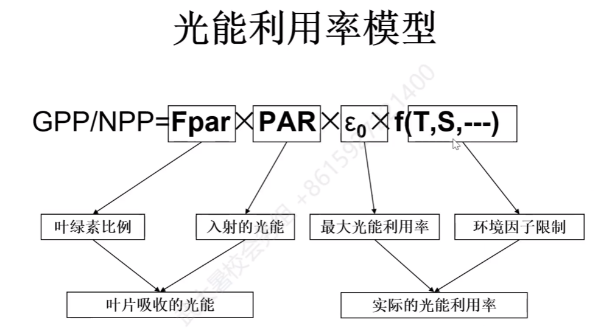

## 农情遥感的挑战与机遇

### 最主要问题

缺乏定量的描述方法，将指数与实际胁迫相关联

### 作物面积监测

#### 主要限制

不论何种方法，都需要地面数据支持

#### 迁移学习

通过迁移学习减少对地面数据的依赖性，

### 作物单产预测

#### 回归分析法

作物种植稀疏的区域（非洲）可以方便使用，种植密度较大的区域（中国，欧洲），效果会大打折扣

Vl saturation leads to poor performance of these indices when predicting yields, especially in dense or irrigated crop regions.

VI饱和导致这些指标在预测产量时表现不佳，特别是在密集或灌溉区。

#### 作物生产模型

The uncertainty of current crop growth models makes it difficult to scale these models up to facilitate operational yield predictions.

当前作物生长模型的不确定性使其难以扩大规模，以促进操作产量预测。

Crop models and/or Vls have not precisely captured crop yield determinants, especially under extreme climatic conditions.

作物模型和/或VIs并没有精确地捕捉到作物产量的决定因素，特别是在极端气候条件下。

New sensors and metrics describing crop phenoty pic and geometric structures as well as data-driven models must be explored

必须探索描述作物表型和几何结构以及数据驱动模型的新传感器和指标

**基于农气信息、关键植被指数和微波特性的统计回归方法**：利用遥感数据和农业气象数据，通过建立线性或非线性的回归模型，计算作物的生物量、收获系数等参数，从而估算作物单产。这种方法简单易行，但是受到地区、作物、年份等因素的影响，需要大量的样本数据进行模型训练和验证。

**基于作物生长过程的物理模型法**：利用作物生理生态模型，模拟作物的生长发育过程，包括光合作用、水分利用、营养吸收、生物量分配等，从而估算作物单产。这种方法能够反映作物与环境的相互作用，但是需要大量的输入参数和初始条件，且存在不确定性和误差。

**生物量和收获系数结合的半经验法**：利用遥感数据和现场调查数据，通过建立半经验的函数关系，计算作物的生物量和收获系数，从而估算作物单产。这种方法结合了统计回归法和物理模型法的优点，但是也受到地区、作物、年份等因素的影响，需要不断更新和优化。

**以机器学习和深度学习为主的数据驱动的预测方法**：利用遥感数据和其他辅助数据，通过建立机器学习或深度学习的模型，如支持向量机、随机森林、人工神经网络等，从而估算作物单产。这种方法能够自动提取特征和规律，适应不同的数据类型和尺度，但是也需要大量的训练数据和计算资源。

### 农情监测系统 CropWatch 提供 API

[CropWatch Cloud](http://cloud.cropwatch.com.cn/)

Cropwatch 是中国领先的农情监测系统，运用遥感和地面观测数据评估国家及全球尺度的作物长势、产量及其相关信息。

### 问答

#### 在作物识别方面，通常识别结果的分辨率是多少，在研究区大小不同的情况下，分辨率是否也需要调整？

地块大小决定选中的空间分辨率大小

## 基于遥感数据估算植被生产力的方法

### 遥感植被生产力模型

#### CASA 模型

#### MODIS-GPP

#### EC-LUE模型

### 高分辨率植被生产力产品

Lin, S.,Huang,X.,Zheng, Y.,Zhang,X.,& Yuan, W.(2022).An Open Data Approach for EstimatingVegetation Gross Primary Production at Fine Spatial Resolution.Remote Sensing,14(11), 2651.(https://www.mdpi.com/2072-4292/14/11/2651)

 

- https://shangrong-lin.users.earthengine.app/view/ec-lue-gpp-landsat-v0

HiGLASS-GPP

### 光合作用途径

#### C3 途径

代表植物：小麦、大豆、水稻

#### C4 途径

固定四个碳，光合作用效率更高，代表植物：玉米、甘蔗、高粱

#### 景天酸代谢（CAM）途径

| 途径              | 固定二氧化碳的酶   | 固定二氧化碳的产物                                  | 发生的细胞             | 优点                                                         | 缺点                               | 代表植物               |
| ----------------- | ------------------ | --------------------------------------------------- | ---------------------- | ------------------------------------------------------------ | ---------------------------------- | ---------------------- |
| C3途径            | rubisco            | 3-PGA（三碳化合物）                                 | 叶肉细胞               | 结构简单，不需要额外的能量消耗                               | 容易受到光呼吸的影响，导致能量损耗 | 小麦、大豆、水稻等     |
| C4途径            | PEP羧化酶和rubisco | 草酰乙酸或苹果酸（四碳化合物）和3-PGA（三碳化合物） | 叶肉细胞和束鞘细胞     | 可以在空间上分离光反应和暗反应，提高二氧化碳浓度，抑制光呼吸 | 需要消耗更多的ATP                  | 玉米、甘蔗、高粱等     |
| 景天酸代谢（CAM） | PEP羧化酶和rubisco | 苹果酸（四碳化合物）和3-PGA（三碳化合物）           | 叶肉细胞（夜晚和白天） | 可以在时间上分离光反应和暗反应，减少水分蒸腾                 | 效率较低                           | 仙人掌、凤梨、龙舌兰等 |
