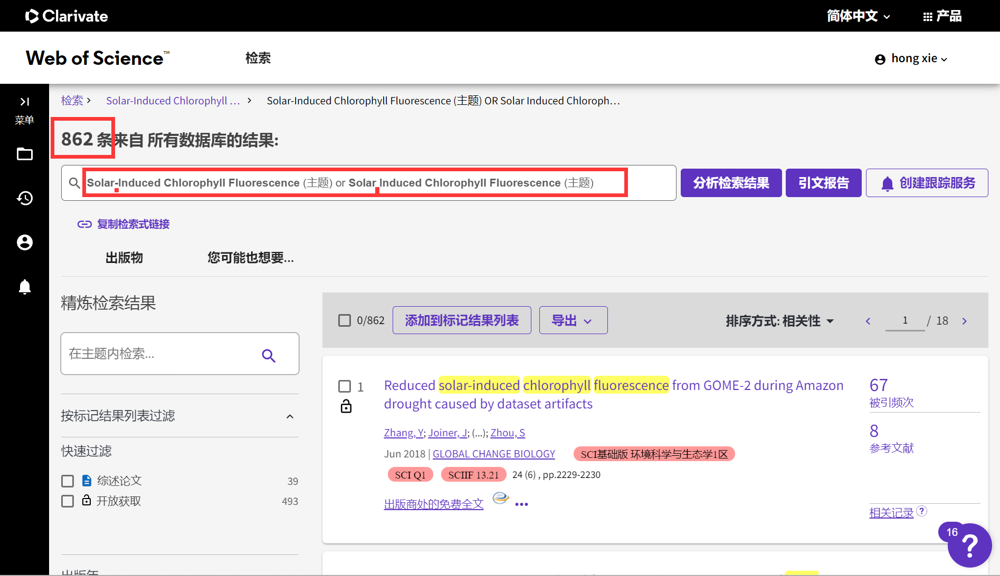
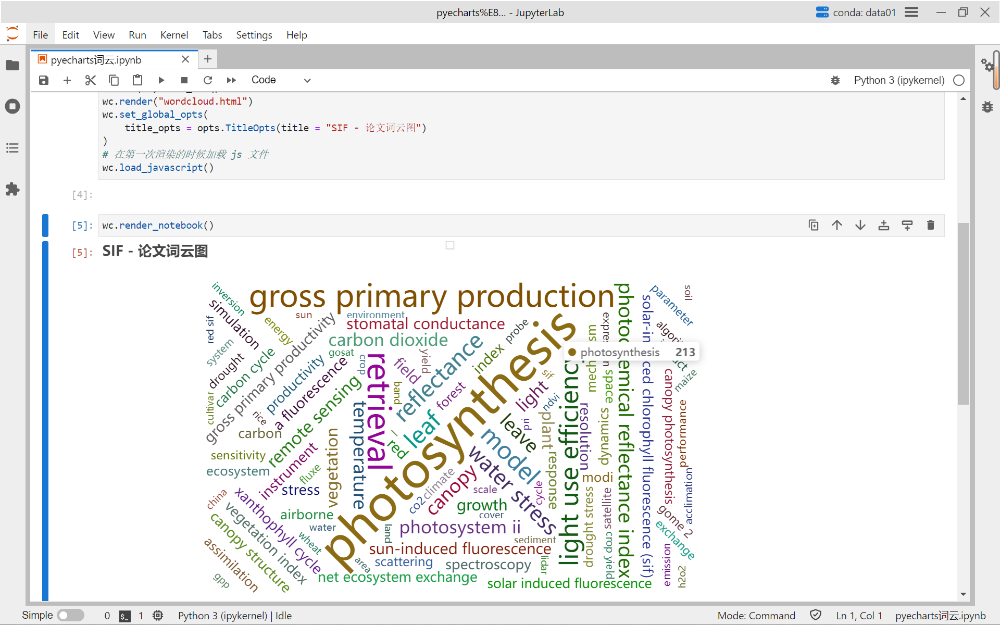

# 还没用上 ChatGPT？那快试试全网通的 New Bing 吧！


## 前言

&emsp;&emsp;本文将介绍如何结合 Web of Science（WOS），Citespace，New Bing，JupyterLab 等工具快速实现论文检索并实现词云可视化的操作。本文以 Solar-Induced Chlorophyll Fluorescence（SIF）太阳诱导的叶绿素荧光相关英文论文为例。


## SIF

&emsp;&emsp;叶绿素在太阳辐射下会发出一种微弱的荧光，这种荧光被称为 Solar-Induced Chlorophyll Fluorescence（SIF），它能反映植物的光合作用强度，并被卫星遥感捕捉到。SIF 是一种新颖的监测陆地初级生产力（GPP）的方法，也是精确反演大气微量气体的关键因素。然而，SIF 并不是完美的光合作用指标，它还受到环境条件、植被结构、叶片特性等多种因素的干扰。为了提高估算精度，需要借助其他遥感指标或模型来校正 SIF 的变化。

&emsp;&emsp;SIF 是一种具有前沿意义和应用价值的遥感参数，它可以帮助我们更好地理解和预测全球碳循环和气候变化。本篇内容也是以SIF的相关论文为例，利用一系列工具进行简单的研究现状可视化分析。


## WOS

&emsp;&emsp;Web of Science（WOS）是全球领先的科学引文索引数据库，汇集了科学技术领域最权威的研究成果。无论是基本文献检索还是高级检索，用户都可以灵活地使用不同的检索字段和运算符，精准地定位或广泛地覆盖相关的信息资源。

&emsp;&emsp;这里我们检索主题满足：`Solar-Induced Chlorophyll Fluorescence` 或 `Solar Induced Chlorophyll Fluorescence` 其中一个条件的论文，截至到发稿日（2023.3.14）共计 862 篇。




## CiteSpace

&emsp;&emsp;CiteSpace 是一款专门用于科学文献分析的 Java 应用程序，能够可视化和揭示不同领域或学科发展中的趋势、模式、关键点和智力转折点。它能够生成交互式的共引网络、时间线、地图等图表，直观地展示文献中的结构和时间特征。用户可以通过灵活的参数设置和过滤条件来探索和提取数据中的有价值信息。作为一种适用于各种学科领域的广泛使用的工具，CiteSpace 还能够帮助用户快速了解一个研究主题的历史背景、核心问题、主要贡献者、热点话题等。


## New Bing

&emsp;&emsp;在 OpenAI 的 ChatGPT 引发热潮之后，微软必应搜索又推出了一款聊天模式搜索引擎，名为 New Bing。它可以用中文和用户进行自然的对话，同时联网查找答案，并生成有创意的内容。我们可以把它简单地理解为一个联网版的 GPT。

&emsp;&emsp;下面我们将利用 New Bing 简单实现对 CiteSpace 中生成的聚类词数据表的可视化分析。

```
请使用 python 将 excel 中的数据制作词云图demo，实现数据可视化，具体要求如下：
1、文件名：SIF
2、有聚类词和词频两列，列名是：Clustering words、Count
3、使用 pyecharts 绘制词云
4、其他默认即可
```


## JupyterLab




<center>图 2 词云图</center>
