# GEE 教程（一）：获取遥感影像——以湖北省为例


## 1 前言

&emsp;&emsp;GEE，Google Earth Engine 谷歌地球引擎，“谷歌地球引擎将 PB 级别的卫星图像和地理空间数据集与行星级分析功能结合起来。科学家、研究人员和开发人员使用地球引擎来检测地球表面的变化、绘制趋势和量化差异。地球引擎现在可用于商业用途，并保持免费的学术和研究使用。”（选自官网介绍翻译）

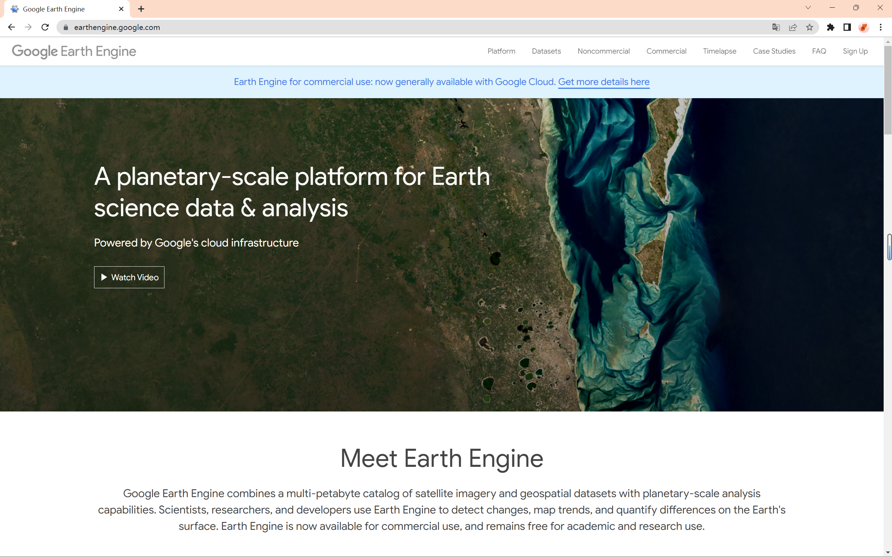

<center>图 1-1 GEE 官网界面</center>


## 2 数据准备

### 2.1 上传中国省级行政区域的矢量数据

- 选中左侧工具框中的 Assets 栏，点击 New 新建数据资源文件即可上传用户数据。

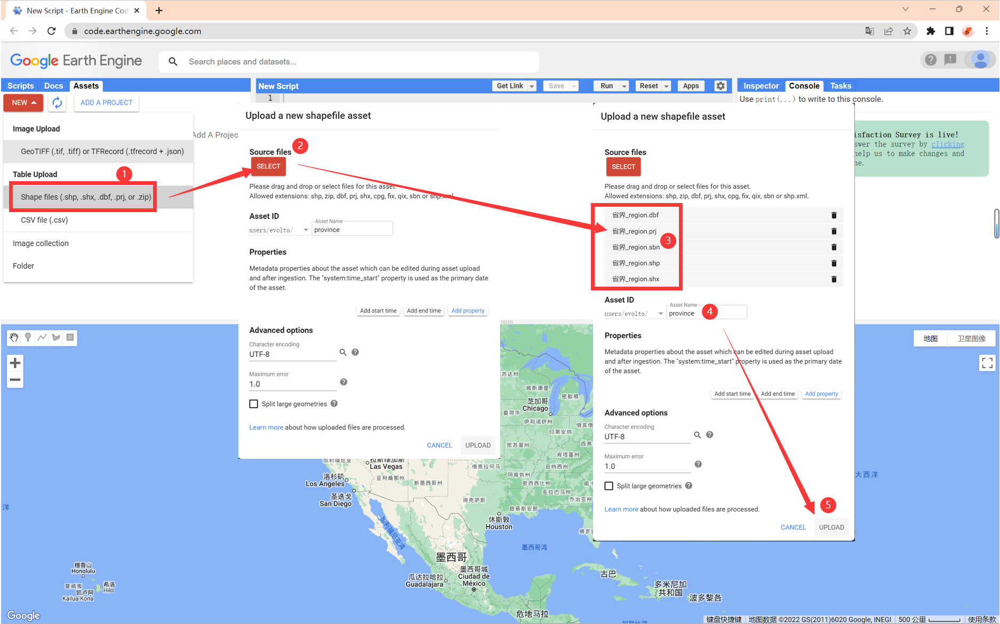

<center>图 2-1 上传数据</center>

- 选中右侧工具框上的 Tasks 栏，查看当前任务情况。可以看到此时数据已经成功上传，并在左侧工具框中的 Asset 栏中显示出来。

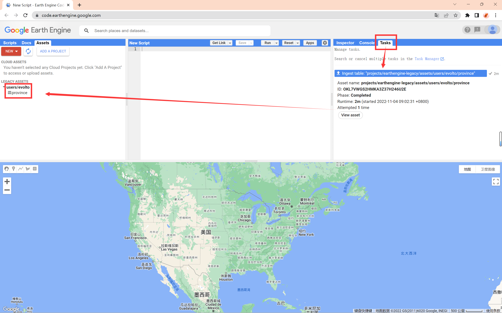

<center>图 2-2 上传成功</center>

### 2.2 导入 Landsat 8 遥感影像

- 点击上方搜索框，搜索 `landsat 8` 即可查询到相关数据

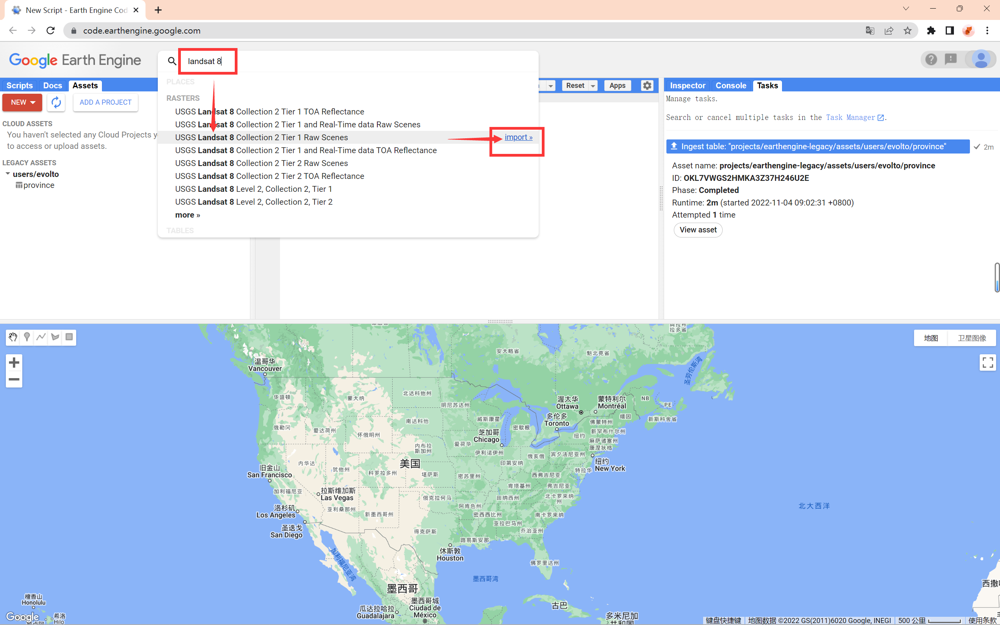

<center>图 2-3 搜索并以导入 Landsat 8 遥感数据</center>

- 导入数据后，在中部的代码编辑框中会出现如下内容，此变量名（imageCollection）可以根据需求自行更改。

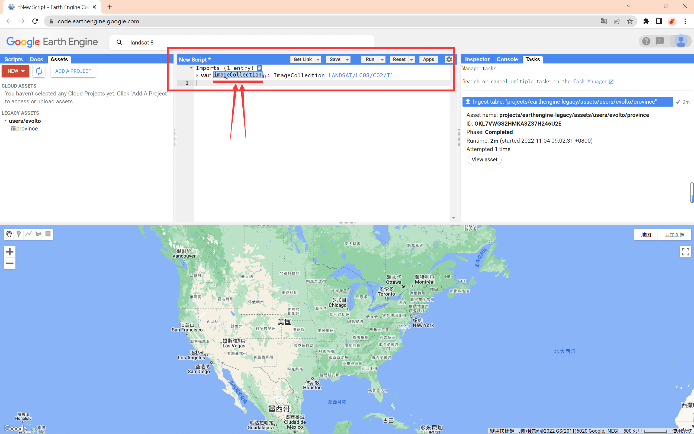

<center>图 2-4 在代码编辑器中查看导入数据</center>


## 3 导入数据

### 3.1 选取中心点

- 因为主界面默认显示的是美国区域，我们先移动到中国范围内，并缩放到湖北省范围内。

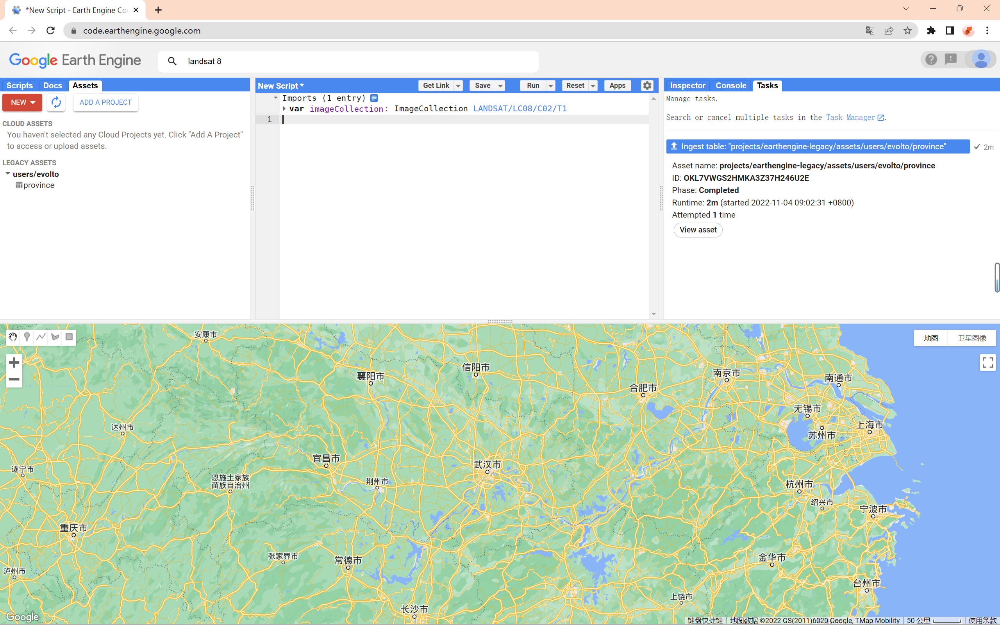

<center>图 3-1 在主界面查看湖北省区域</center>

- 在地图框中的左上角工具栏中，选中点标记开始添加标记。在添加标记点后，在代码编辑器中可以立即反馈成如图所示的代码。

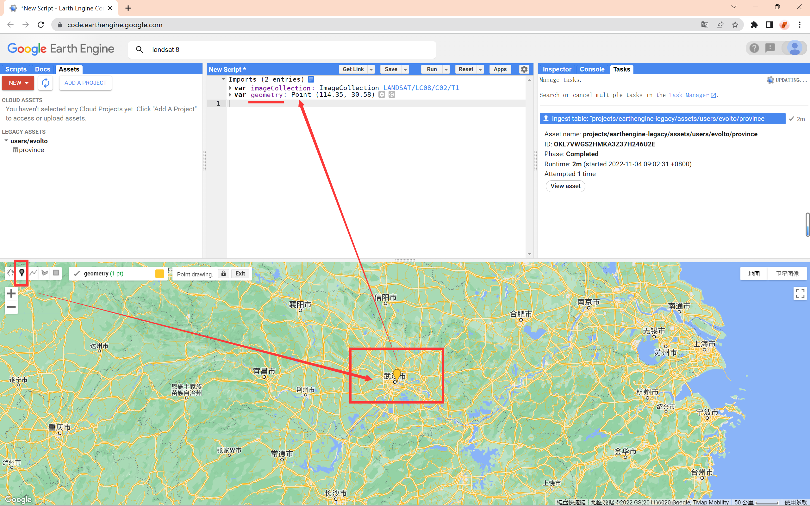

<center>图 3-2 添加点标记</center>

### 3.2 导入行政区数据

- 接下来我们要导入上传好的省份数据，同之前的导入数据操作类似，导入后会在代码编辑框中立即反馈出来。

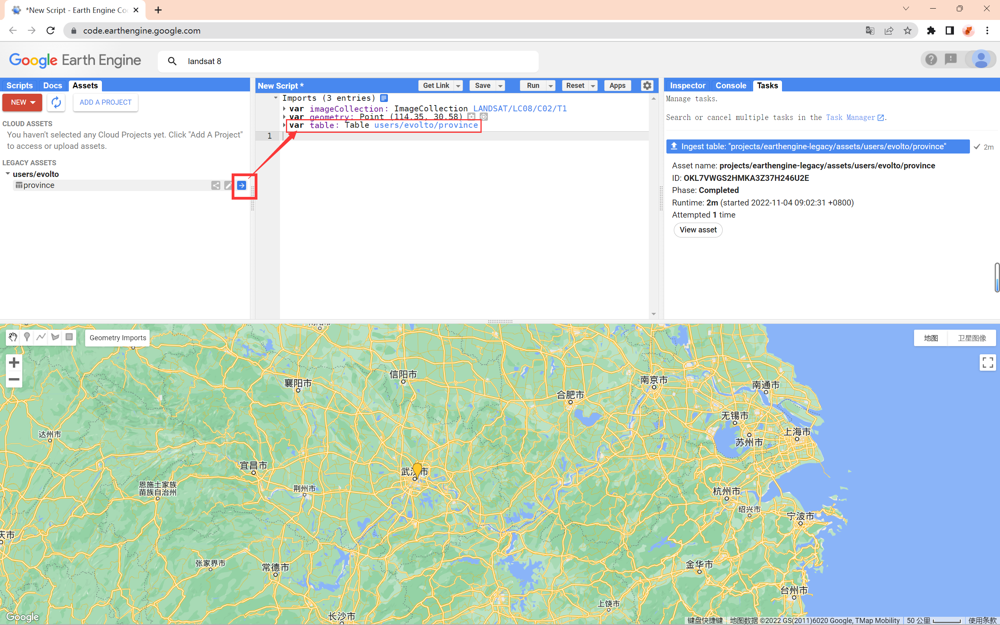

<center>图 3-3 导入省份数据</center>

### 3.3 查看导入数据的代码内容

- 在代码编辑器中点击 Import 栏的 Show generated code 按钮查看生成的代码。

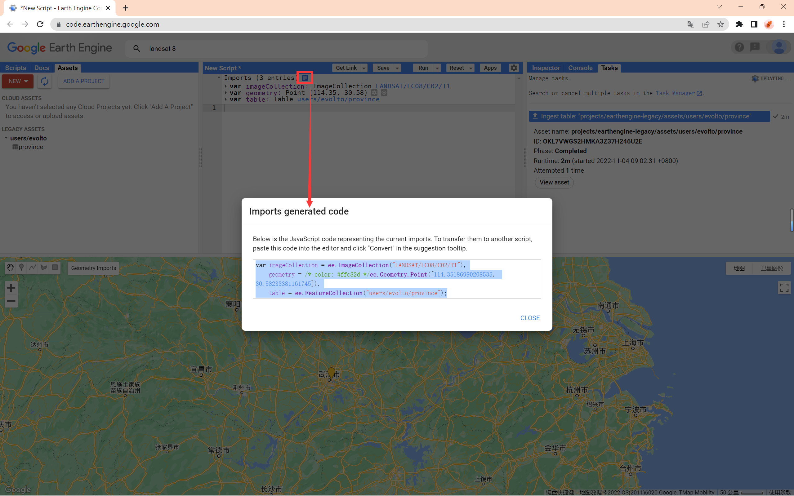

<center>图 3-4 查看生成的代码</center>

- 代码内容如下：

```js
var imageCollection = ee.ImageCollection("LANDSAT/LC08/C02/T1"),
    geometry = /* color: #ffc82d */ee.Geometry.Point([114.35186990208535, 30.58233381161745]),
    table = ee.FeatureCollection("users/evolto/province");
```

### 3.4 修改变量名称

- 为了方便后续调用，已经代码理解，我们将导入数据的变量名修改为以下内容。

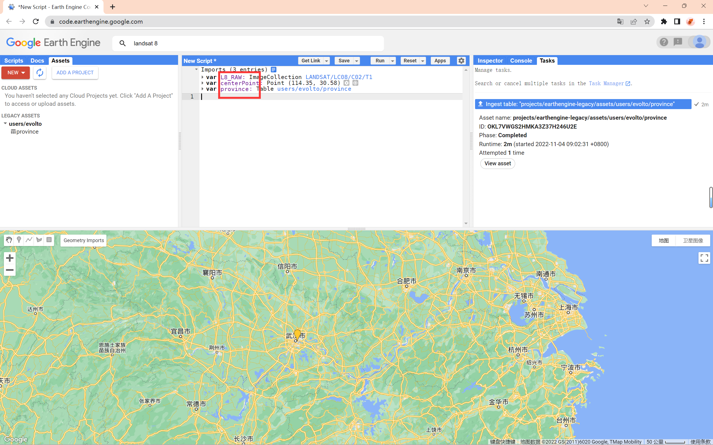

<center>图 3-5 修改变量名称</center>

- 此时生成的代码为：

```js
var L8_RAW = ee.ImageCollection("LANDSAT/LC08/C02/T1"),
    centerPoint = /* color: #ffc82d */ee.Geometry.Point([114.35186990208535, 30.58233381161745]),
    province = ee.FeatureCollection("users/evolto/province");
```


## 4 代码实现

### 4.1 代码

- 在导入所需数据后，我们就可以通过代码进行相关操作了。
- 这里首先我们从上传的全国省级行政区划数据中通过属性筛选出湖北省，随后筛选遥感数据的时段并结合湖北省区域进行 `clip()` 裁剪，最后将计算结果添加到图层上进行可视化显示。

```js
// 利用属性筛选重湖北省的行政区边界
var hb = province.filterMetadata('ID', 'equals', 'Hubei').first().geometry();

// 筛选遥感影像时间
var L8_Filtered = L8_RAW.filterDate('2020-01-01', '2021-12-31');

// 裁剪图像
var hb_No_Cloud = ee.Algorithms.Landsat.simpleComposite(L8_Filtered).clip(hb);

// 添加图层及其影像
Map.addLayer(hb, {}, '湖北省');
Map.addLayer(hb_No_Cloud, {
  bands: ['B5', 'B4', 'B3'],
  gamma: 1.3,
  max: 108,
  min: 15
}, '湖北省L8图像');

// 将地图的显示中心定位到之前添加的中心点，缩放界别调整为 6 级
Map.centerObject(centerPoint, 6);
```

### 4.2 运行结果

- 最终的运行结果如下，点击 Run 按钮，将会在地图界面添加两个图层并显示出来。

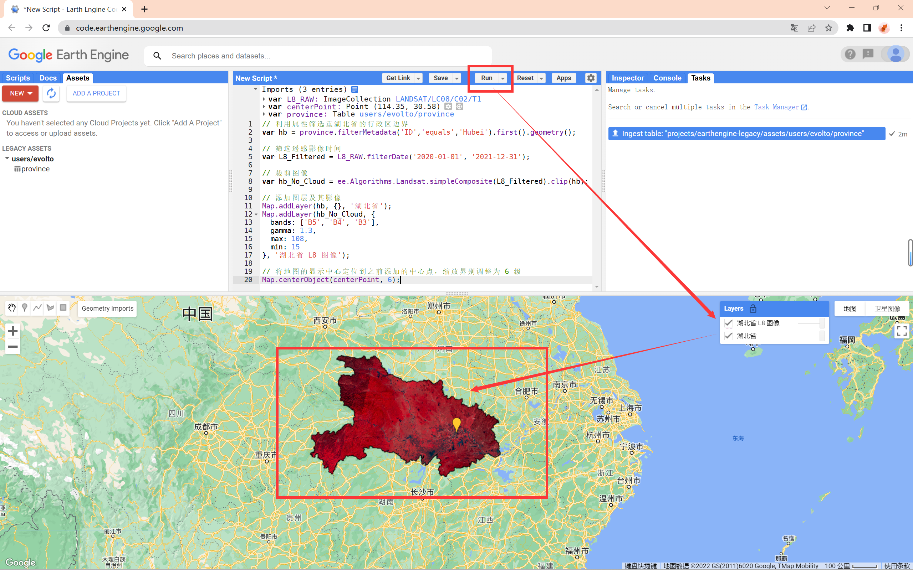

<center>图 4-1 运算结果展示</center>

### 4.3 完整代码

```js
// 导入数据
var L8_RAW = ee.ImageCollection("LANDSAT/LC08/C02/T1"),
  centerPoint = /* color: #ffc82d */ ee.Geometry.Point([114.35186990208535, 30.58233381161745]),
  province = ee.FeatureCollection("users/evolto/province");

// 利用属性筛选重湖北省的行政区边界
var hb = province.filterMetadata('ID', 'equals', 'Hubei').first().geometry();

// 筛选遥感影像时间
var L8_Filtered = L8_RAW.filterDate('2020-01-01', '2021-12-31');

// 裁剪图像
var hb_No_Cloud = ee.Algorithms.Landsat.simpleComposite(L8_Filtered).clip(hb);

// 添加图层及其影像
Map.addLayer(hb, {}, '湖北省');
Map.addLayer(hb_No_Cloud, {
  bands: ['B5', 'B4', 'B3'],
  gamma: 1.3,
  max: 108,
  min: 15
}, '湖北省L8图像');

// 将地图的显示中心定位到之前添加的中心点，缩放界别调整为 6 级
Map.centerObject(centerPoint, 6);
```

