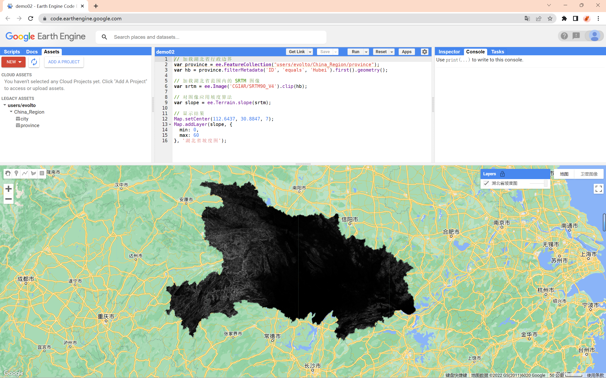
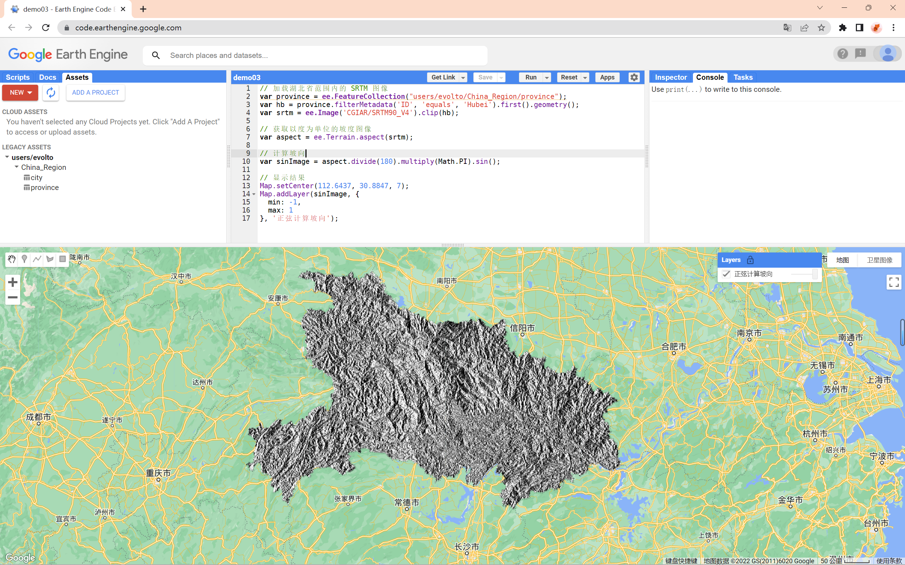
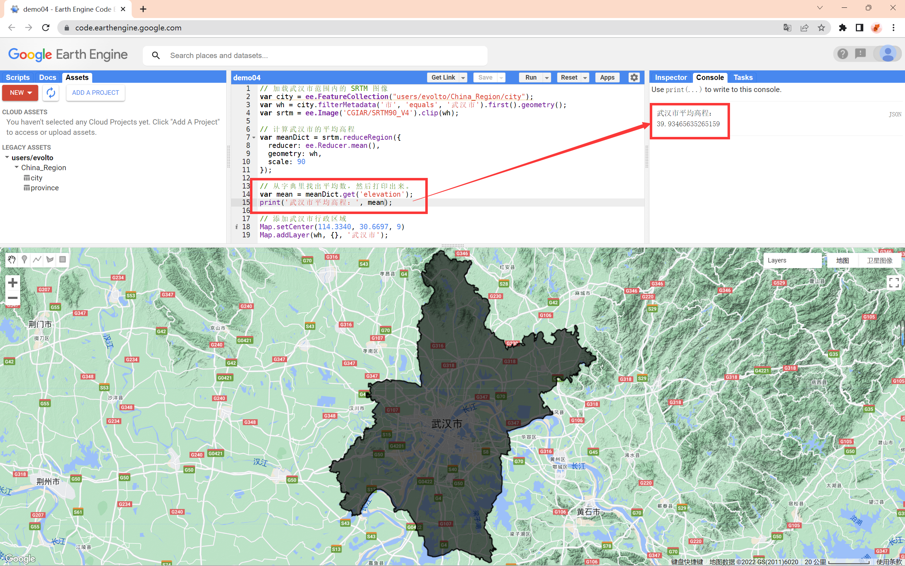

# GEE 教程（二）：遥感图像的基本计算


## 1 计算坡度

### 1.1 代码实现

&emsp;&emsp;现在我们已经知道了如何加载和显示所需区域的图像了，接下来就可以对其进行应用计算了。

&emsp;&emsp;例如，我们可以通过将 SRTM 高程图像传递给 `ee.Terrian` 包中的 `slope()` 方法来计算地形的坡度。

```js
// 加载湖北省行政边界
var province = ee.FeatureCollection("users/evolto/China_Region/province");
var hb = province.filterMetadata('ID', 'equals', 'Hubei').first().geometry();

// 加载湖北省范围内的 SRTM 图像
var srtm = ee.Image('CGIAR/SRTM90_V4').clip(hb);

// 对图像应用坡度算法
var slope = ee.Terrain.slope(srtm);

// 显示结果
Map.setCenter(112.6437, 30.8847, 7);
Map.addLayer(slope, {
  min: 0,
  max: 60
}, '湖北省坡度图');
```

**【注】**：在代码 `ee.Terrain.slope(srtm)` 中，`SRTM` 图像是作为坡度算法的参数提供的。

### 1.2 结果展示

- 结果应该如图 1 所示。



<center> 图 1 湖北省坡度图（基于 SRTM 图像）</center>


## 2 计算坡向

### 2.1 代码实现

&emsp;&emsp;`ee.Image` 类中还有一些方法可以在图像对象上调用。我们可以使用图像带（有时称为带数学或映射代数）进行一些计算。

- 例如，如果我们需要实现对坡度图像上的三角运算，首先要将一个坡向图像转换为弧度，然后对它调用 `sin()` 函数计算。
- 这里我们仍然使用 `SRTM` 图像进行操作。

```js
// 加载湖北省范围内的 SRTM 图像
var province = ee.FeatureCollection("users/evolto/China_Region/province");
var hb = province.filterMetadata('ID', 'equals', 'Hubei').first().geometry();
var srtm = ee.Image('CGIAR/SRTM90_V4').clip(hb);

// 获取以度为单位的坡度图像
var aspect = ee.Terrain.aspect(srtm);

// 计算坡向
var sinImage = aspect.divide(180).multiply(Math.PI).sin();

// 显示结果
Map.setCenter(112.6437, 30.8847, 7);
Map.addLayer(sinImage, {
  min: -1,
  max: 1
}, '正弦计算坡向');
```

-  `aspect.divide(180).multiply(Math.PI).sin()` ：除以 $180$ 后，将其结果再乘以 $π$，最后取 $sin()$
- 我们可以通过这种方式组合各种方法，从而对图像执行复杂的数学运算。

### 2.2 结果展示

- 结果应该如图 2 所示。



<center>图 2 坡向计算</center>


## 3 计算平均高程

### 3.1 代码实现

&emsp;&emsp;此外，另一类实用的图像操作涉及到计算图像区域的像素统计，或者是光栅-矢量叠加。如果我们想在 Earth Engine 中计算统计信息，则需要使用 `ee.Reducer` 包中的 类对 `reducer` 进行操作。

&emsp;&emsp;例如，我们对武汉市内的平均海拔感兴趣，就需要使用以下代码获取武汉市行政区域内的平均像素值：

```js
// 加载武汉市范围内的 SRTM 图像
var city = ee.FeatureCollection("users/evolto/China_Region/city");
var wh = city.filterMetadata('市', 'equals', '武汉市').first().geometry();
var srtm = ee.Image('CGIAR/SRTM90_V4').clip(wh);

// 计算武汉市的平均高程
var meanDict = srtm.reduceRegion({
  reducer: ee.Reducer.mean(),
  geometry: wh,
  scale: 90
});

// 从字典里找出平均数，然后打印出来。
var mean = meanDict.get('elevation');
print('武汉市平均高程：', mean);

// 添加武汉市行政区域
Map.setCenter(114.3340, 30.6697, 9)
Map.addLayer(wh, {}, '武汉市');
```

&emsp;&emsp;这里有几点需要注意。

1. 首先，要注意到 `reducregion()` 是对 `Image` 对象操作的方法。
2. 其次，方法参数是在作为单个参数传递的 JavaScript 对象中提供的。（具体来说，对象的键是方法参数的名称。值是方法的参数）。
3. 第三，`reducer` 参数指定要计算的统计量类型，`geometry` 参数指定要计算统计量的区域。`scale` 参数是要使用的像素大小，以米为单位。为了避免歧义，在进行约分化简时应该始终指定比例，因为 Earth Engine 可能无法从输入中自动确定适当的比例。
4. 最后，`reducregion()` 的返回值是一个字典类型，其中，键是条带名称，值是条带的像素统计信息。字典上的 `get()` 方法返回作为参数提供的键对应的值。在本例中，SRTM 图像有一个频带 “elevation”，因此代码从字典中获取该统计数据并打印出来。
5. 同时，还要注意的是，区域中的像素最多只允许 10000000 个点，超出范围将会在控制台报错。

### 3.2 结果展示



<center>图 3 计算武汉市平均高程</center>