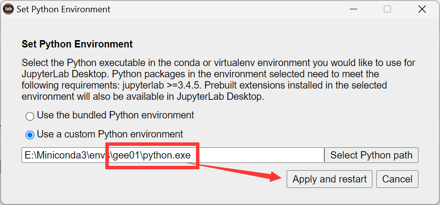
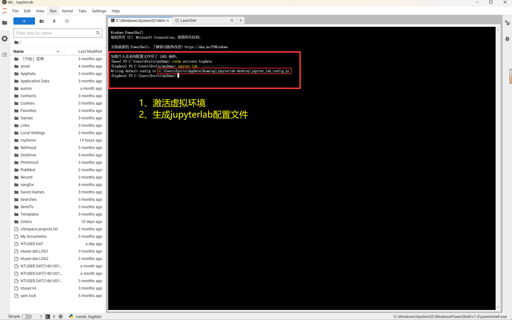
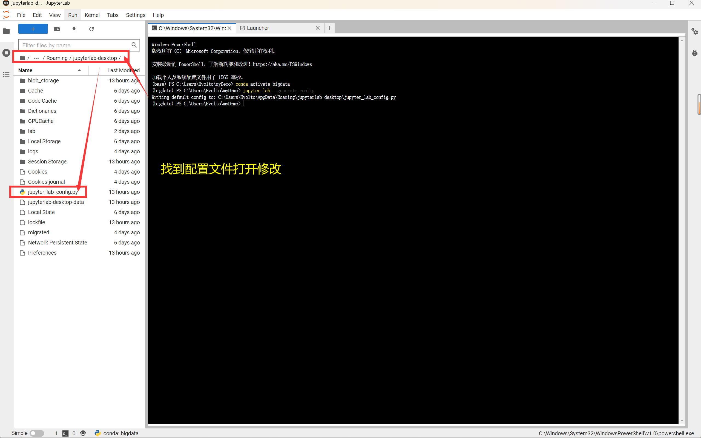
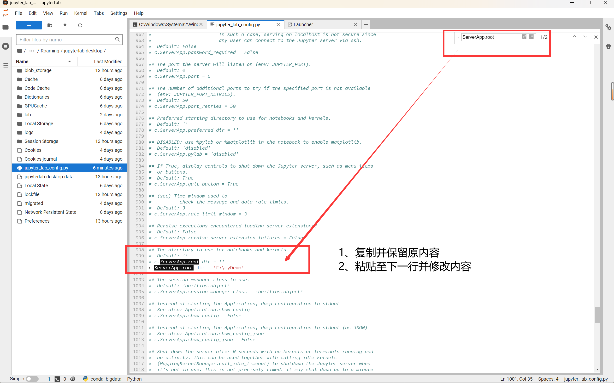
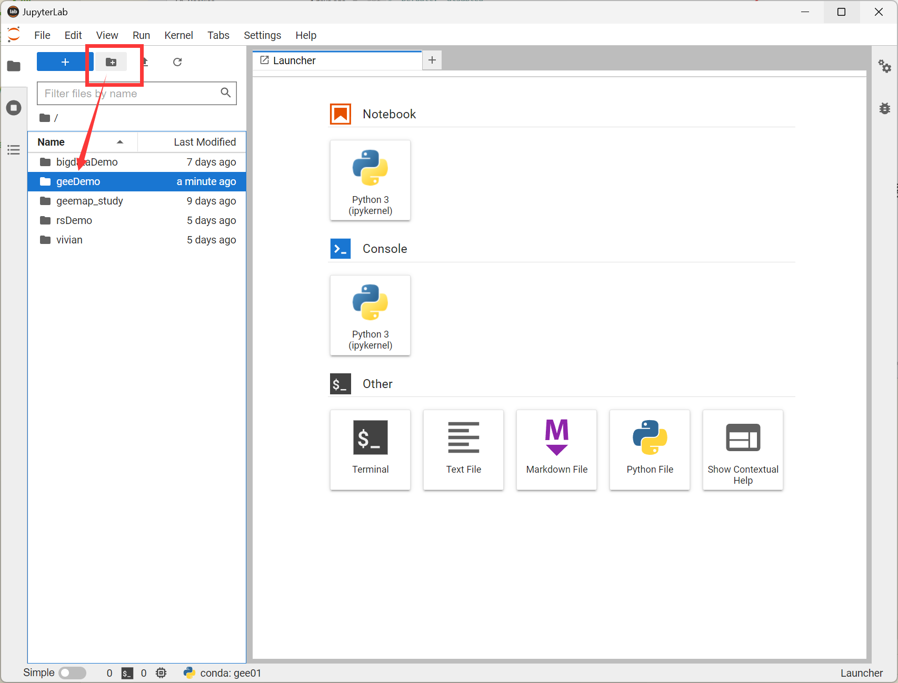
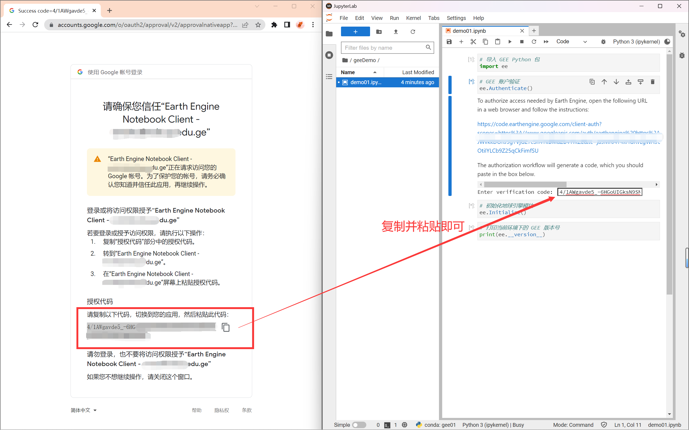
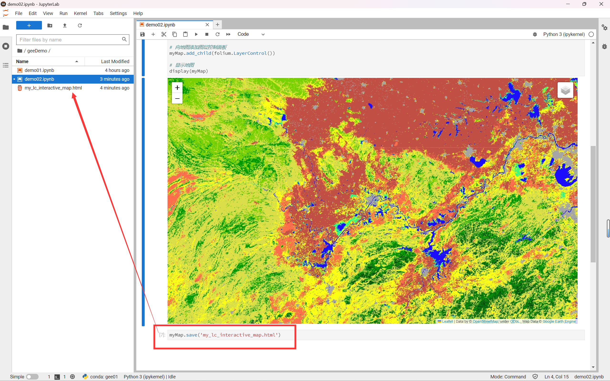

# GEE 教程（三）：GEE Python API 的配置与使用


## 1 虚拟环境配置

&emsp;&emsp;首先，我们需要在 cmd 命令行中使用 conda 命令创建一个 `python3.9` 的虚拟环境，并在激活环境后安装 Earth Engine 的 API 库。

> 创建虚拟环境

```sh
conda create -n gee01 python=3.9
```

> 激活虚拟环境

```sh
conda activate gee01
```

> 安装 Earth Engine 的 API 库

```sh
conda install -c conda-forge earthengine-api
```


## 2 安装 JupyterLab Windows 桌面版

### 2.1 下载并安装 

&emsp;&emsp;官网下载地址：https://github.com/jupyterlab/jupyterlab-desktop

1. 在启动之前，还需要先在虚拟环境中安装 JupyterLab 包，否则在安装桌面版后，将无法正常启动

> 安装 JupyterLab

```sh
conda install -c conda-forge jupyterlab
```

2. 安装很简单，同意相关条款之后会直接默认安装在 `C:\JupyterLab` 目录

3. 首次运行程序时，需要选定调用 Python 环境，这里我们选择之前创建并配置好的虚拟环境



<center>图 2-1 配置 JupyterLab 启动环境</center>

4. JupyterLab 界面介绍


<center>图 2-2 JupyterLab 界面介绍</center>

### 2.2 配置 JupyterLab 工作目录

&emsp;&emsp;由于 JupyterLab 默认的工作目录是 Windows 的当前用户根目录，我们可以将工作目录修改为一个固定的代码存放目录。

&emsp;&emsp;参考资料：[修改 Jupyter Lab、Jupyter Notebook 的工作目录 - CSDN](https://blog.csdn.net/xing09268/article/details/123919230)

1. 在除 C 盘外的其他盘根目录下，创建一个名为 `myDemo` 的文件，用于存放后续代码文件和数据操作文件

2. 执行以下命令，在如图显示的文件夹下生成 `jupyter_lab_config.py` 文件

> 生成 jupyterlab 配置文件

```sh
jupyter-lab --generate-config
```



<center>图 2-3 生成 jupyterlab 配置文件</center>

3. 找到配置文件后，双击打开



<center>图 2-4 查找配置文件</center>

4. 按住 `ctrl+f`，搜索 `ServerApp.root` ，将其修改为：

```python
c.ServerApp.root_dir = 'E:\myDemo'
```



<center>图 2-5 修改 JupyterLab 工作目录</center>

### 2.3 创建文件夹

&emsp;&emsp;重新启动 JupyterLab，此时左侧的工作目录已经修改了，在此目录下创建一个名为 `geeDemo` 的文件夹，用于存放代码文件和数据操作文件，完成后双击进入。



<center>图 2-6 创建文件夹</center>

&emsp;&emsp;在完成上述配置后，我们就可以开始真正的实验操作了。步骤虽然繁琐，但都是一劳永逸的，后续学习不需要再次配置上述内容。


## 3 GEE Python API 的简单操作

### 3.1 检查安装情况

&emsp;&emsp;接下来，我们要创建一个名为 `demo01.ipynb ` 的文件，用于检查 GEE 的配置情况。

&emsp;&emsp;在这里，账户验证仅第一次使用 GEE Python API 时需要运行，之后进行其他文件运行时，不需要再次输入运行。

> 导入 GEE Python 包

```python
import ee
```

> GEE 账户验证

```python
ee.Authenticate()
```

> 初始化地球引擎模块

```python
ee.Initialize()
```

> 打印当前环境下的 GEE 版本号

```python
print(ee.__version__)
```



<center>图 3-1 账户验证</center>

### 3.2 安装第三方交互式地图库

&emsp;&emsp;由于 Earth Engine UI 模块只能通过 JavaScript API 代码编辑器使用。在 Python  API 中想要使用 UI 元素需要借助第三方库：如 Folium 和 ipyleaflet 提供交互式地图处理。

&emsp;&emsp;所以我们需要在虚拟环境中另行安装这两个包。在 cmd 命令行中激活虚拟环境，并使用 conda 命令安装两个包。

> 激活虚拟环境

```sh
conda activate gee01
```

> 安装 Folium

```sh
conda install folium -c conda-forge
```

> 安装 ipyleaflet

```sh
conda install ipyleaflet -c conda-forge
```

### 3.3 使用 Folium 的交互式地图

&emsp;&emsp;Folium 是一个基于 leaflet.js（用于移动友好型交互式地图的开源 JavaScript 库）的 python 库，我们可以使用它来制作交互式地图。Folium 支持 WMS、GeoJSON 层、矢量图层和切片层，这使得我们使用 Python 处理的数据可视化变得非常方便和直接。

&emsp;&emsp;接下来，我们重新创建一个新的 `*.ipynb` 文件，使用 GEE 与 Folium 结合，实现土地覆盖 (LC) 数据的可视化。

> 导入 GEE Python 包并初始化

```python
import ee
ee.Initialize()
```

> 导入 Folium 交互式地图包

```python
import folium
```

> 增加了一种将地球引擎图像瓦片显示到 folium 地图的方法

```python
def add_ee_layer(self, ee_image_object, vis_params, name):
    map_id_dict = ee.Image(ee_image_object).getMapId(vis_params)
    folium.raster_layers.TileLayer(
        tiles=map_id_dict['tile_fetcher'].url_format,
        attr='Map Data &copy; <a href="https://earthengine.google.com/">Google Earth Engine</a>',
        name=name,
        overlay=True,
        control=True
    ).add_to(self)
```

> 将 Earth Engine 绘图方法添加到 folium

```python
folium.Map.add_ee_layer = add_ee_layer
```

> 导入 MODIS 土地覆盖集合

```python
lc = ee.ImageCollection('MODIS/006/MCD12Q1')
```

> 为土地覆盖选择一个特定的波段和日期

```python
# 设置日期
i_date = '2017-01-01'

# 设置波段
i_band = 'LC_Type1'

# 根据日期与波段过滤土地覆盖结果
lc_img = lc.select(i_band).filterDate(i_date).first()
```

> 设置土地覆盖的可视化参数

```python
lc_vis_params = {
    'min': 1,'max': 17,
    'palette': ['05450a','086a10', '54a708', '78d203', '009900', 'c6b044',
                'dcd159', 'dade48', 'fbff13', 'b6ff05', '27ff87', 'c24f44',
                'a5a5a5', 'ff6d4c', '69fff8', 'f9ffa4', '1c0dff']
}
```

> 创建并显示地图组件

```py
# 创建地图定义地图中心位置和缩放级别
lat, lon = 30.55, 114.30
myMap = folium.Map(location=[lat, lon], zoom_start=7)

# 添加土地覆盖图层到地图组件
myMap.add_ee_layer(lc_img, lc_vis_params, 'Land Cover')

# 向地图添加图层控制面板
myMap.add_child(folium.LayerControl())

# 显示地图
display(myMap)
```

> 将地图以 HTML 的格式保存到本地

```python
myMap.save('my_lc_interactive_map.html')
```



<center>图 3-2 jupyterlab 运行界面</center>


<center>图 3-3 土地覆盖地图</center>
