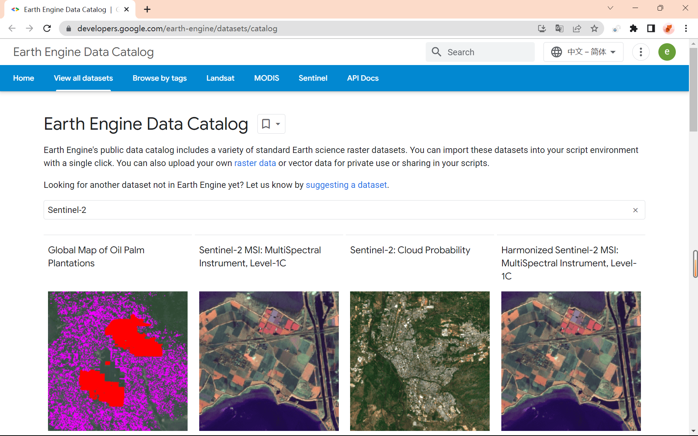
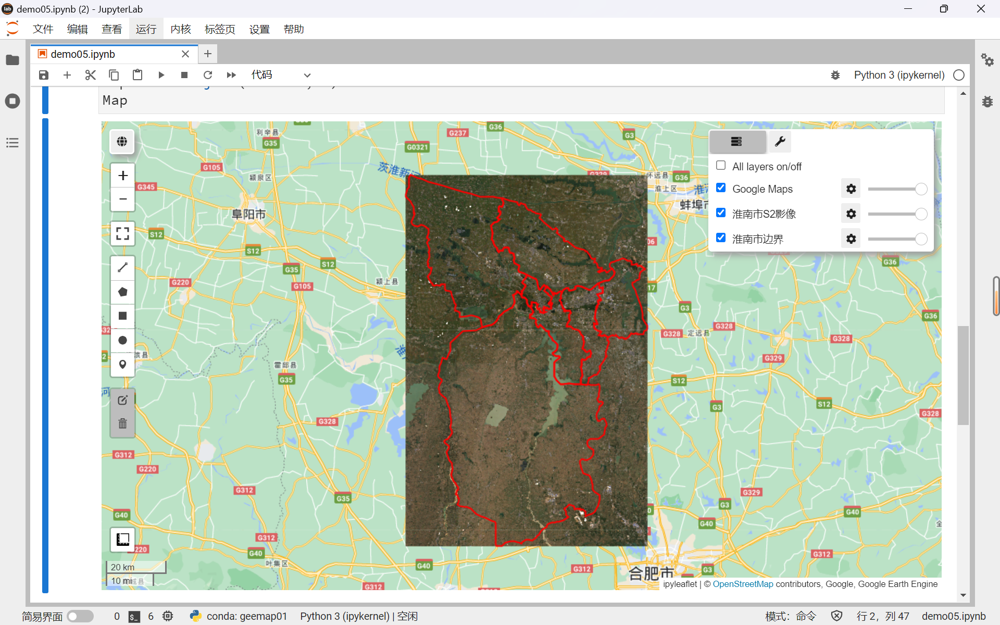
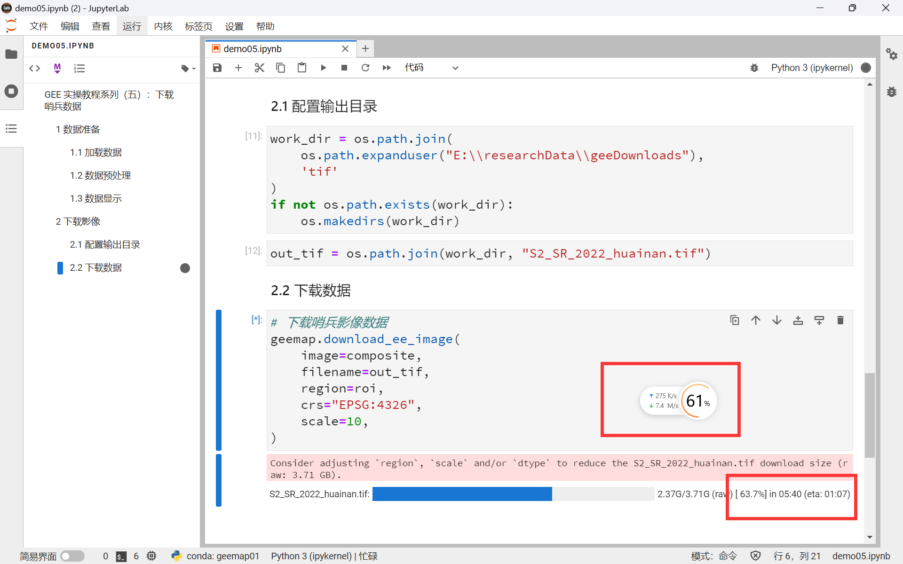
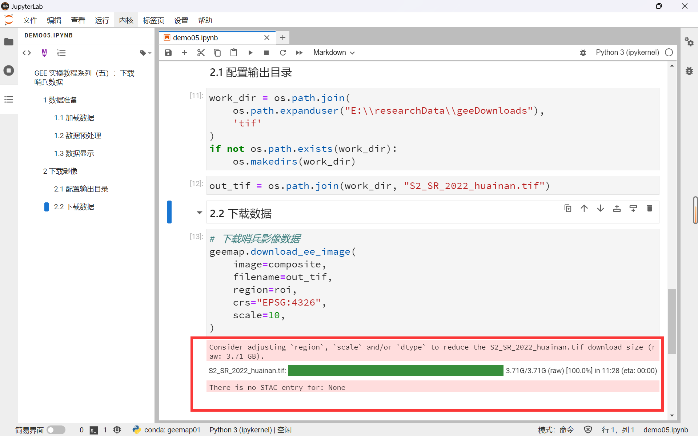
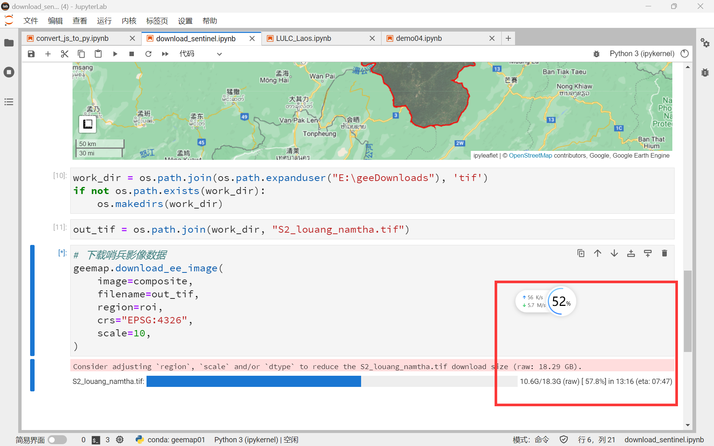
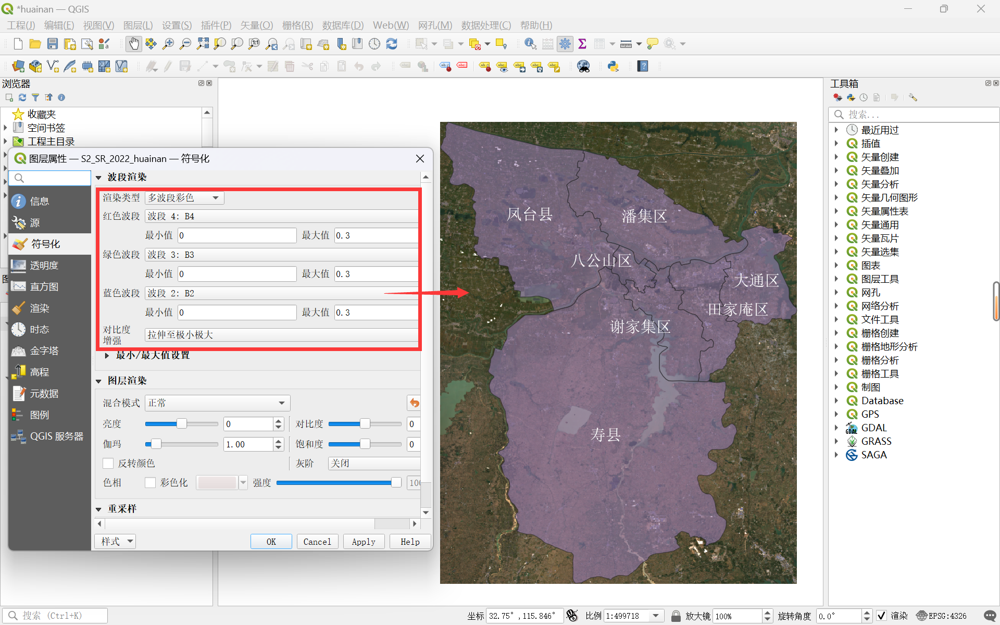

# GEE 教程（六）：突破限制! GEE 数据直接下载本地


## 相关参考

- [Sentinel-2 Datasets in Earth Engine  | Earth Engine Data Catalog  | Google Developers](https://developers.google.com/earth-engine/datasets/catalog/sentinel-2)
- [ 吴秋生 Geemap 教程 | 118 下载影像](https://geemap.org/notebooks/118_download_image/)


## 前言

在以往我们在 GEE 平台下载数据时，往往都是先将数据导出到谷歌硬盘中，再由谷歌硬盘下载到本地。但是我们的谷歌硬盘初始只有 15G 大小，存储小型数据尚可，数据稍大我们就只能先分割影像数据分别下载后，再合并成一张图像。

那么有没有一种方法可以突破 GEE 的限制，轻松地下载 GEE 平台数据呢？

在上节 [GEE 教程（五）](https://mp.weixin.qq.com/s?__biz=MzIxNDQ0NDY1NQ==&mid=2247497194&idx=1&sn=174b189b140cb45060d700fa6009b5af&chksm=97a5caeaa0d243fcb48db31609a0e1cd61ff4ab8ca76b6227d7850ab9d246fb49de49c84ab96&scene=178&cur_album_id=2650193990876659713#rd) 中，我们利用 Geemap 包以安徽省淮南市为例，制作了基于 Landsat 影像的时光流动画。在本篇教程中，我们将继续以安徽省淮南市为目标区域，学习 Geemap 包的影像下载操作。

在本篇教程中，你将学习到以下内容：

- GEE 平台对于数据下载的限制
- GEE 平台中哨兵2号的各个数据集的相关信息
- 如何使用 Geemap 包直接将 GEE 平台数据下载至本地


## 1 为什么使用 Geemap 下载数据？

### 1.1 GEE 对于数据下载的限制

GEE Python API 提供的 `ee_export_image()` 函数可以直接下载地球引擎的图像数据，输出格式可以是 GeoTIFF 或 TFRecord。下载的数据大小取决于你指定的区域、分辨率和波段数，以及你选择的输出目标。具体的数据下载方式及其限制如下表所示：

| 下载方式                         | 下载限制                           |
| -------------------------------- | ---------------------------------- |
| 直接下载到本地                   | 单次数据大小不能超过 2GB           |
| 导出到 Google Drive 再下载       | 单次数据大小不能超过 10GB          |
| 导出到 Google Earth Engine Asset | 单次数据大小不能超过 10GB          |
| 导出到 Google Cloud Storage      | 单次数据大小没有限制，但是需要付费 |

所以，无论是直接下载到本地还是先导出到谷歌硬盘再下载，只要我们下载的数据超过了大小限制，就必须进行分割区域或降低分辨率，或者使用其他的输出目标，这样就导致了下载过程过于繁琐，而 Geemap 包中的 `download_ee_image()` 函数则很好地解决了这个问题。

### 1.2 `download_ee_image()` 函数

1. 使用 `download_ee_image()` 函数可以绕开 GEE 本地下载的 2G 限制
2. 下载 GeoTIFF 格式的 Earth Engine 图像，大于 Earth Engine 大小限制的图像将被拆分并作为单独的图块下载，最后重新组合成一个完整的 GeoTIFF。

### 1.3 注意事项

在使用该函数下载数据时应注意以下几点：

1. 保证魔法工具的稳定性与网络畅通
2. 下载影像前最好不要完全按照研究区域裁剪，可以改用研究区域的最小外接矩形做为影像裁剪边界
3. 下载数据前最好先选择好所用波段，否则数据过大在下载完成后会自动无损压缩


## 2 数据准备

### 2.1 数据说明

GEE 平台上的数据目录，可以在：[Earth Engine Data Catalog  | Google Developers](https://developers.google.com/earth-engine/datasets/catalog) 中检索查看。



<center>图 2-1 GEE 数据目录检索 Sentinel-2 相关数据</center>

下表是小编简要总结的 GEE 平台上哨兵2号（Sentinel-2）的 5 种数据集相关介绍：

| 种类                            | 简介                                 | 数据集可用性   |
| ------------------------------- | ------------------------------------ | -------------- |
| COPERNICUS/S2                   | 哨兵2号的 Level-1C 级数据            | 2015-06-23至今 |
| ==COPERNICUS/S2_HARMONIZED==    | 消除偏移量的 S2 数据                 | 2015-06-23至今 |
| COPERNICUS/S2_CLOUD_PROBABILITY | 使用机器学习方法创建的 S2 云概率数据 | 2015-06-23至今 |
| COPERNICUS/S2_SR                | 基于S2的地表反射率数据，Level-2A 级  | 2017-03-28至今 |
| ==COPERNICUS/S2_SR_HARMONIZED== | 消除偏移量的 S2_SR 数据              | 2017-03-28至今 |

> 官网关于 HARMONIZED 的说明：
>
> Sentinel Level-1C 和 Level-2A 数据产品具有统一的时间序列。"HARMONIZED" 标志意味着04.00处理基线中增加到反射波段的与波段有关的偏移量已被消除。偏移量影响2022年1月24日之后的数据;消除偏移量会使这些数据与04.00之前的基线数据在光谱上对齐。如果你正在使用 `COPERNICUS/S2` 或 `COPERNICUS/S2_HARMONIZED`，建议你切换到 `COPERNICUS/S2_HARMONIZED` 和 `COPERNICUS/S2_SR_HARMONIZED`。

### 2.2 加载数据

这里我们仍然使用上节  [GEE 教程（五）](https://mp.weixin.qq.com/s?__biz=MzIxNDQ0NDY1NQ==&mid=2247497194&idx=1&sn=174b189b140cb45060d700fa6009b5af&chksm=97a5caeaa0d243fcb48db31609a0e1cd61ff4ab8ca76b6227d7850ab9d246fb49de49c84ab96&scene=178&cur_album_id=2650193990876659713#rd)  使用的淮南市为目标区域，使用 Sentinel-2 Level-2A  级数据产品，并裁剪出目标区域的影像。

```python
s2 = ee.ImageCollection('COPERNICUS/S2_SR_HARMONIZED')
huainan = geemap.geojson_to_ee("./input/huainan.json")
```

### 2.3 数据预处理

1、将 `ee.FeatureCollection` 转换为 `ee.geometry` 格式的最小外接矩形

```python
roi = huainan.geometry().bounds()
```

2、借助 Sentinel-2 数据中的 QA60 字段去云，这是 GEE 官网提示的去云函数。

```python
def maskS2clouds(image):
    qa = image.select('QA60')
    # Bits 10 and 11是云，我们要把它mask掉
    cloudBitMask = 1 << 10
    cirrusBitMask = 1 << 1
    # 这两个标志都应该设置为0，表示条件明确。
    mask = qa.bitwiseAnd(cloudBitMask).eq(0) \
        .And(qa.bitwiseAnd(cirrusBitMask).eq(0))
    # 哨兵的像元值是反射率的10000倍，要除以10000
    return image.updateMask(mask).divide(10000)
```

3、筛选出待下载的哨兵影像数据集

```python
collection = s2.filterDate('2022-01-01', '2022-12-31') \
              .filter(ee.Filter.lt('CLOUDY_PIXEL_PERCENTAGE', 10)) \
              .filterBounds(huainan) \
              .map(maskS2clouds) \
              .select('B[1-8]')
```

- 时间段 2022 年全年、云层覆盖率小于 $10\%$、以目标区域为边界、遍历去云函数、选取 1~8 波段

4、将影像数据集计算中值后得到的单幅影像针对目标区域进行裁剪，得到最终待下载数据

```python
composite = collection.median().clip(roi)
```

### 2.4 数据显示

1、在下载数据之前，我们可以先查看待下载的影像的显示效果。首先我们设置栅格和矢量的可视化参数，查看待下载影像的 RGB 真彩色图像。

```python
rgbVis = {
  'min': 0.0,
  'max': 0.3,
  'bands': ['B4', 'B3', 'B2'],
}
# 设置显示样式：color代表边界颜色；fillcolor代表填充颜色
styling = {
    'color': 'red',
    'fillColor': '00000000'
}
```

2、随后创建一个 Map 实例，将栅格和矢量添加到图层中。

```python
Map = geemap.Map()
Map.addLayer(composite, rgbVis, '淮南市S2影像')
Map.addLayer(huainan.style(**styling), {}, '淮南市边界')
Map.centerObject(huainan, 9)
Map
```



<center>图 2-2 目标区域哨兵影像</center>

## 3 下载数据

### 3.1 配置输出目录

在确认待下载影像无误后，我们只需要设置好输出目录，就可以开始下载数据了。

```python
work_dir = os.path.join(os.path.expanduser("E:\\researchData\\geeDownloads"), 'tif')
if not os.path.exists(work_dir):
    os.makedirs(work_dir)

out_tif = os.path.join(work_dir, "S2_SR_2022_huainan.tif")
```

### 3.2 下载数据

直接使用 `download_ee_image()` 函数，并设置好关键参数，运行后就可以开始无限制下载 GEE 平台数据了。

```python
geemap.download_ee_image(
    image=composite,
    filename=out_tif,
    region=roi,
    crs="EPSG:4326",
    scale=10,
)
```

- 主要参数有：待下载的影像、输出目录、目标区域、坐标系、分辨率等。

这里可以看到我们本次下载的数据大小为 3.71G，超出了原生 GEE Python API 所能支持的 2G 本地下载上限，所以会提示让我们修改目标区域、分辨率或者数据类型来减少下载的数据大小。但是不用担心，我们可以正常下载数据。【大型数据要注意魔法工具的稳定性】



<center>图 3-1 下载数据</center>



<center>图 3-2 下载完成</center>

下图是小编下载一幅 18.3 G大小影像的下载过程，可以看到，也是可以正常下载的。



<center>图 3-3 下载大型数据<center>


### 3.3 显示数据

最后，我们使用 QGIS 打开下载好的数据，检查数据是否完整可用。这里我们设置与 Geemap 中相同的 432 波段真彩色可视化参数显示。



<center>图 3-4 QGIS 打开下载图像<center>
