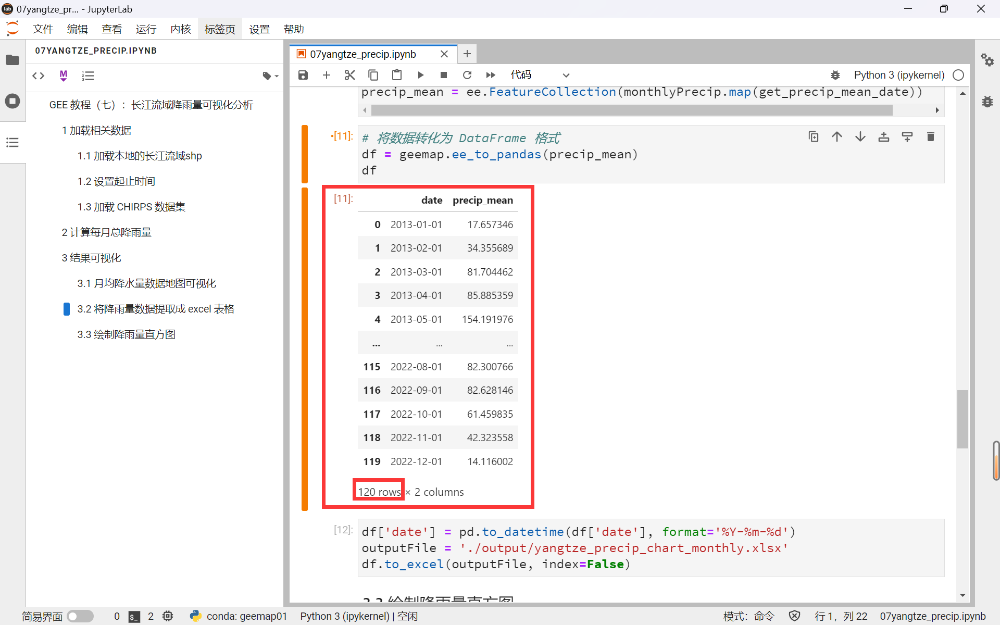

# Geemap 教程（七）：长江流域降雨量可视化分析


## 前言

在前几期的教程中，我们已经体验了 geemap 包对本地与 GEE 服务器之间联系的强力支持，如本地数据加载、数据无限制下载等。

本篇教程的目标是利用 geemap 包对长江流域近十年的降雨量进行计算和可视化。我们将使用 CHIRPS 数据集作为降雨量数据源，结合 numpy、pandas、matplotlib 包实现数据的图表可视化。在本篇教程中，你将学习到以下内容：

| 内容                                 | 方法                                    |
| :----------------------------------- | :-------------------------------------- |
| 加载本地 shapefile 数据              | 使用 `geemap.shp_to_ee()` 函数          |
| 计算研究区域降雨量数据               | 通过 CHIRPS Pentad 数据集               |
| `ee.Feature` 格式转 `DataFrame` 格式 | 使用 `geemap.ee_to_pandas()` 函数       |
| 实现数据的图表可视化                 | 结合 `numpy`、`pandas`、`matplotlib` 包 |


## 1 CHIRPS 数据集

### 1.1 介绍

CHIRPS (The Climate Hazards Group InfraRed Precipitation with Station) 数据集是一个准全球性的降雨数据集（Funk等，2015），涵盖了 1981 年到当前 40 多年的时间。CHIRPS 以 0.05°（约5公里）的空间分辨率提供降水信息，并通过将气象站观测数据与卫星数据相结合来估算降水量。CHIRPS 数据可提供从 Day 到 Year 的时间间隔，并在水文学研究中非常有价值，因为它提供了一个长期且一致的时间序列，其中包含了相对较高分辨率的降水估算数据。


<center>图 1-1 检索 CHIRPS 数据集</center>

### 1.2 CHIRPS Daily 和 CHIRPS Pentad

我们在 [Earth Engine Data Catalog](https://developers.google.com/earth-engine/datasets) 中检索 `CHIRPS` 可以看到，它分为两支：CHIRPS Daily 和 CHIRPS Pentad，它们的区别是：

- CHIRPS Pentad 的主要计算时间步长是 pentad，即五天的分组。一个日历月有六个 pentad：五个五天的pentad 和一个 pentad 以及该月剩余的三到六天。pentad 在每个月初重置。
- CHIRPS Daily 是每日数据集，通过分解计算 CHIRPS Pentad 数据得来的。
- CHIRPS Daily 和 CHIRPS Pentad 都可以用于趋势分析和季节性干旱监测，但除非特别需要每日数据，否则应该使用 CHIRPS Pentad 数据集。

<center>表 1-1 两种 CHIRPS 数据集对比</center>

| 数据集        | 时间分辨率 | 空间分辨率 | 数据来源                      | 适用场景                 |
| :------------ | :--------- | :--------- | :---------------------------- | :----------------------- |
| CHIRPS Pentad | 每五日     | 0.05°      | 卫星图像和站点数据的结合      | 趋势分析和季节性干旱监测 |
| CHIRPS Daily  | 每日       | 0.05°      | 由 CHIRPS Pentad 分解计算得到 | 特殊需要每日数据的情况   |


## 2 编程实现

### 2.1 导入必要包

在本次教程中，我们需要使用三个常用的 python 数据分析工具包： `numpy`、`pandas`、`matplotlib`

```python
import ee
import geemap
import numpy as np
import pandas as pd
import matplotlib.pyplot as plt
ee.Initialize()
geemap.set_proxy(port="魔法工具的端口号")
```

### 2.2 加载相关数据

1、首先，我们使用 `geemap.shp_to_ee()` 函数，直接调用本地的 shapefile 格式的长江流域数据。【回复 ***长江*** 获取资源】

```python
yangtzeBasin = geemap.shp_to_ee('E:/researchData/Yangtze/YangtzeBasin.shp')
```

2、接着，我们设置研究的起止时间，这里小编亲测在 GEE Code Editor 平台中最多只能 9 年的时间跨度，超过就会出现用户内存报错，导致无法计算，这是 GEE 平台对用户的 算力限制。

而使用 geemap 调用 GEE Python API 就不会轻易出现这个情况。这里我们设置研究时间为近 10 年：2013-01-01 ~ 2022-12-01，这在  Code Editor 平台上是无法直接实现的。

```python
startYear = 2013
endYear = 2022
# 为开始年份和结束年份创建两个日期对象
startDate = ee.Date.fromYMD(startYear, 1, 1)
endDate = ee.Date.fromYMD(endYear + 1, 1, 1)
# 创建一个年份列表
years = ee.List.sequence(startYear, endYear)
# 创建一个月份列表
months = ee.List.sequence(1, 12)
```

3、加载 CHIRPS 数据集

```python
CHIRPS = ee.ImageCollection('UCSB-CHG/CHIRPS/PENTAD')
CHIRPS = CHIRPS.filterDate(startDate, endDate)
```

### 2.3 计算每月总降雨量

接下来，是降雨量计算的关键步骤，我们创建一个函数，该函数应用一个嵌套循环，首先在相关年份进行映射，然后在相关月份进行映射，返回值是一个包含月度降雨量(P)波段图像。

最终将结果转化为一个 `ee.ImageCollection` 只含有月度总降雨量信息的影像集合。

```python
def caculate_months(y):
    def caculate_all(m):
        # 筛选出每月降雨量并求出当月总和
        P = CHIRPS.filter(ee.Filter.eq('year', y)) \
                .filter(ee.Filter.eq('month', m)) \
                .sum()
        # 返回一个图像，只含有一个降雨量波段
        return P.set('year', y) \
                .set('month', m) \
                .set('date', ee.Date.fromYMD(y, m, 1))
    return months.map(caculate_all)
# flatten() 将特征的特征集合转换为单个特征集合
# 再将结果转化为 ImageCollection
monthlyPrecip = ee.ImageCollection.fromImages(
    years.map(caculate_months).flatten()
)
```


## 3 结果可视化

### 3.1 月均降水量数据地图可视化

然后我们就可以将降雨量数据加载到地图中进行显示。

```python
precipVis = {
  'min': 0,
  'max': 250,
  'palette': ['white', 'blue', 'darkblue', 'red', 'purple']
}
Map = geemap.Map()
Map.centerObject(yangtzeBasin, 5)
Map.addLayer(yangtzeBasin, {}, '长江流域')
Map.addLayer(monthlyPrecip.mean().clip(yangtzeBasin), precipVis, '月均降水')
Map
```


<center>图 3-1 长江流域近十年 (2013~2022) 月均降雨量地图</center>

### 3.2 将降雨量数据提取成 excel 表格

1、我们定义一个函数，用于对每个影像的降雨量波段数值求均值，并返回一个包含降雨量和时间属性的Feature

2、使用ee.ImageCollection.map()方法来对影像集合中每个影像应用上面定义的函数

3、需要注意的是，map() 函数返回的是一个 ee.ComputedObject 类型的对象，所以我们还要将结果转化为ee.FeatureCollection，才能利用 geemap 包转化成 DataFrame 格式

4、将要素集合转化成 DataFrame 格式并导出到本地 excel 表格，可以看到近 10 年，120 个月的降雨量数据都导出在表格中了

```python
region = yangtzeBasin.geometry()
def get_precip_mean_date(image):
    # 对降雨量波段数值求均值，使用ee.Reducer.mean()方法，并指定区域和缩放比例
    mean = image.reduceRegion(ee.Reducer.mean(), region, 5000).get('precipitation')
    # 获取影像的日期，使用ee.Date()方法，并格式化为YYYY-MM-dd
    date = ee.Date(image.get('date')).format('YYYY-MM-dd')
    # 返回一个包含降雨量和时间的要素，使用ee.Feature()方法，并设置几何和属性
    return ee.Feature(None, {'date': date, 'precip_mean': mean})
precip_mean = ee.FeatureCollection(monthlyPrecip.map(get_precip_mean_date))
# 将数据转化为 DataFrame 格式
df = geemap.ee_to_pandas(precip_mean)
# 将时间数据从字符串格式重新转化为时间格式
df['date'] = pd.to_datetime(df['date'], format='%Y-%m-%d')
# 将 df 导出成 excel 表格
outputFile = './output/yangtze_precip_chart_monthly.xlsx'
df.to_excel(outputFile, index=False)
```



<center>图 3-2 查看 DataFrame 表内容</center>


<center>图 3-3 查看导出的降雨量数据表格</center>

### 3.3 绘制降雨量直方图

最后，我们利用 matplotlib 包，实现长江流域近十年降雨量直方图的绘制

```python
df = pd.read_excel(outputFile)
# 设置图形的大小
plt.figure(figsize=(12, 6))
# 将date读取为只显示年份-月份的形式
df['date'] = df['date'].dt.strftime('%Y-%m')
# 绘制柱状图，使用日期作为x轴，平均降水量作为y轴
plt.bar(df['date'], df['precip_mean'])
# 设置x轴的刻度，每隔1年(12个日期)显示一个标签
plt.xticks(np.arange(0, len(df), 12))
# 设置x轴和y轴的标签
plt.xlabel('Time')
plt.ylabel('Precipitation (mm)')
# 设置图形的标题
plt.title('Yangtze River Basin monthly precipitation (2013~2022)')
# 显示图形
plt.show()
```


<center>图 3-4 长江流域近十年降雨量直方图</center>


## 4 小结

本次教程利用 geemap 包对长江流域近十年的降雨量进行了计算和可视化。

- 首先，通过 geemap.shp_to_ee() 函数加载了本地 shapefile 数据作为研究区域。
- 其次，通过 CHIRPS 数据集获取了降雨量数据，并使用 geemap.ee_to_pandas() 函数将 ee.Feature 格式数据转化为 DateFrame 格式数据。
- 最后，结合 numpy、pandas、matplotlib 包实现了数据的地图可视化和图表可视化。

这些操作实现了 GEE 平台与本地 Python 的数据分析工具的充分结合，提高了遥感分析的自由化程度，同时也缓解了 GEE 对于用户的部分算力限制。在后续的几期教程中，将继续探索研究区域的水量平衡、植被生长、干旱信息和土地覆盖信息等方面的内容。


## 5 相关参考

[1] Gee-tutorials. Aquatic and Hydrological Applications |River morphology[EB/OL]. https://google-earth-engine.com/Aquatic-and-Hydrological-Applications/River-morphology/. [2023-5-11].
