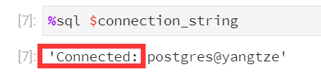

# Geemap 教程（一）：Geemap 包的介绍与使用


## 前言

&emsp;&emsp;通过上节 [GEE 实操教程系列（三）](http://mp.weixin.qq.com/s?__biz=MzIxNDQ0NDY1NQ==&mid=2247496252&idx=1&sn=69e3a49a6748354c87133ecabfddfc3c&chksm=97a5cd3ca0d2442a760cdf90130ad0133c99610033abfcd64e4eae52ee72ba0adaa020036fd1&scene=21#wechat_redirect) 的内容，我们初步学习了 GEE Python API 的基本操作，接下来我们将针对 GEE Python API 进一步学习，本次教程我们将介绍 ***Geemap 包的基本使用***。


## 1 Geemap

### 1.1 Geemap 介绍

&emsp;&emsp;Geemap 是由美国田纳西大学吴秋生老师开发的，一个用于与 Google Earth Engine（GEE）、ipyleaflet 和 ipywidgets 进行交互式映射的 Python 包。

&emsp;&emsp;由于 GEE Python API 的文档相对较少且交互式可视化结果的功能较为有限。geemap Python 包就是为了填补这个空白而创建的。它建立在 ipyleaflet 和 ipywidgets 之上，使用户能够在基于 Jupyter 的环境中以交互方式分析和可视化 Earth Engine 数据集。

&emsp;&emsp;Geemap 是基于 pygis 和 GEE Python 包开发的，依赖环境较为复杂，所以在安装 Geemap 包的同时，GEE Python API 环境以及 Python 常用的开发工具 jupyter notebook 和 jupyterlab 等都将一并安装。


<center>图 1-1 Geemap 官网</center>

### 1.2 为什么要使用 Geemap？

&emsp;&emsp;因为 GEE JavaScript API 的广泛使用和大量的相关文档，导致很多现有教程和算法都是基于 JavaScript 进行设计开发的，而 JavaScript API 又只能在 GEE 代码编辑器中运行，且不方便调用本地已有的数据资源。

&emsp;&emsp;原生的 Python API 虽然可以实现本地数据的自由调用，却不方便调用现有的基于 JavaScript API 设计开发的功能和算法，使用 Geemap 包进行辅助开发就可以解决这些 GEE 的使用痛点。

&emsp;&emsp;简单来说，通过 Geemap 包，我们可以实现 **本地数据 + GEE 云端海量数据资源 + GEE 平台算力 + 数据自由下载** 等一系列操作。


## 2 配置开发环境

### 2.1 创建并激活虚拟环境

&emsp;&emsp;首先，我们需要在 cmd 命令行中使用 conda 命令创建一个 `python3.9` 的虚拟环境用于后续操作。

> 创建虚拟环境

```sh
conda create -n geemap01 python=3.9 -y
```

> 激活虚拟环境

```sh
conda activate geemap01
```

### 2.2 使用 mamba 配置环境

&emsp;&emsp;由于 geemap 所依赖的开发环境较为复杂，所以需要一个优秀的包管理器进行安装配置，这里我们使用的是 mamba。

&emsp;&emsp;mamba 是一个快速、健壮、跨平台的包管理器。它运行在 Windows、macOS 和 Linux 上，完全兼容 conda 包，支持 conda 的大部分命令。可以通过 mamba 来配置安装 geemap 所依赖的复杂环境。

> conda 安装 mamba

```sh
conda install -c conda-forge mamba -y
```

> mamba 安装 geemap

```sh
mamba install -c conda-forge pygis geemap jupyterlab jupyterlab-language-pack-zh-CN
```

- 注：中间停顿的话记得按回车哦。

<!--  -->


<center>图 2-1 mamba 批量安装包</center>


## 3 调用本地数据

&emsp;&emsp;接下来，我们的代码都将运行在上节 [GEE 实操教程系列（三）](http://mp.weixin.qq.com/s?__biz=MzIxNDQ0NDY1NQ==&mid=2247496252&idx=1&sn=69e3a49a6748354c87133ecabfddfc3c&chksm=97a5cd3ca0d2442a760cdf90130ad0133c99610033abfcd64e4eae52ee72ba0adaa020036fd1&scene=21#wechat_redirect) 介绍的 JupyterLab 桌面版中。下面我们将借助 geemap 调用 PostGIS 中现有存储的数据并将其显示在 GEE 平台上。

### 3.1 起手配置

> 导入需求包

```python
import os
import ee
import geemap
from IPython.display import display
```

> 在 VPN 中使用 geemap

```python
geemap.set_proxy(port="7890")
```

> 初始化地图并启动

```python
Map = geemap.Map(center=[30, 114], zoom=7)
Map
```


<center>图 3-1 geemap 显示地图</center>

### 3.2 从 PostGIS 中导入数据

&emsp;&emsp;再次打开命令行，并激活 `geemap01` 环境，使用 `mamba` 安装数据库相关包。

```sh
mamba install -c conda-forge ipython-sql sqlalchemy psycopg2 pandas
```

&emsp;&emsp;随后我们回到 jupyterlab 中，继续运行代码。

> 加载 sql

```python
%load_ext sql
```

> 配置 PostGIS 数据库连接

```python
host = "localhost"
database = "yangtze"
user = "postgres"
password = "123qwe"
connection_string = f"postgresql://{user}:{password}@{host}/{database}"
```

> 检查连接情况

```python
%sql $connection_string
```



<center>图 3-2 查看数据库连接情况</center>

> 查询表内数据

```python
sql1 = 'SELECT * FROM campus'
sql2 = 'SELECT * FROM hualin'
gdf1 = geemap.read_postgis(sql1, connection_string)
gdf2 = geemap.read_postgis(sql1, connection_string)
display(gdf1,gdf1)
```


<center>图 3-3 查询并打印表内数据</center>

> 将数据添加至图层

```python
m = geemap.Map()
campusLayer = m.add_gdf_from_postgis(
    sql1, connection_string, layer_name="校内区域", fill_colors=["red", "green", "blue"]
)
hualinLayer = m.add_gdf_from_postgis(
    sql2, connection_string, layer_name="华林区域", fill_colors=["red", "green", "yellow"]
)
m.add_basemap('SATELLITE')
display(m)
```


<center>图 3-4 在 GEEMAP 中查看数据</center>


