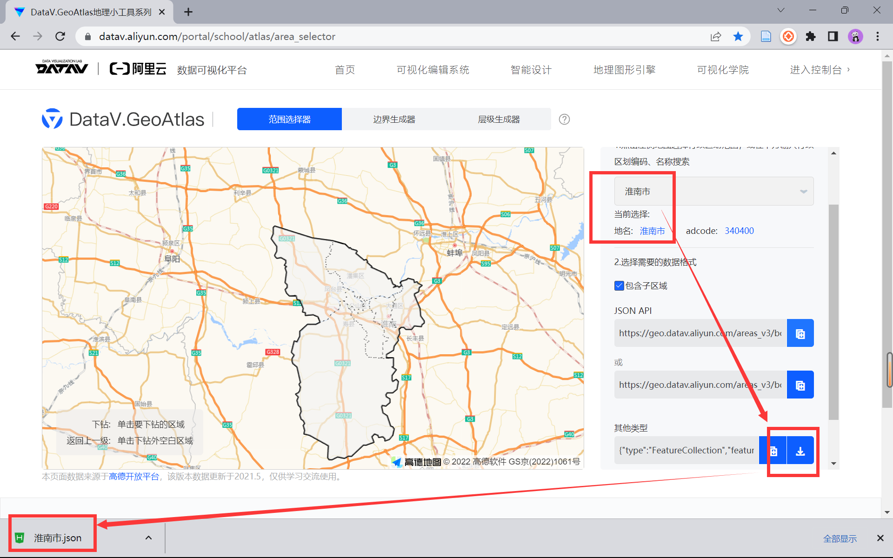
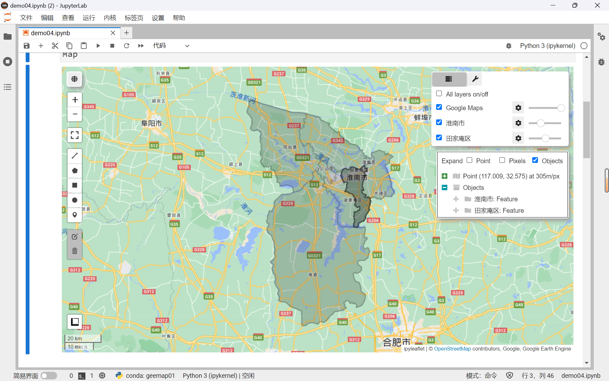
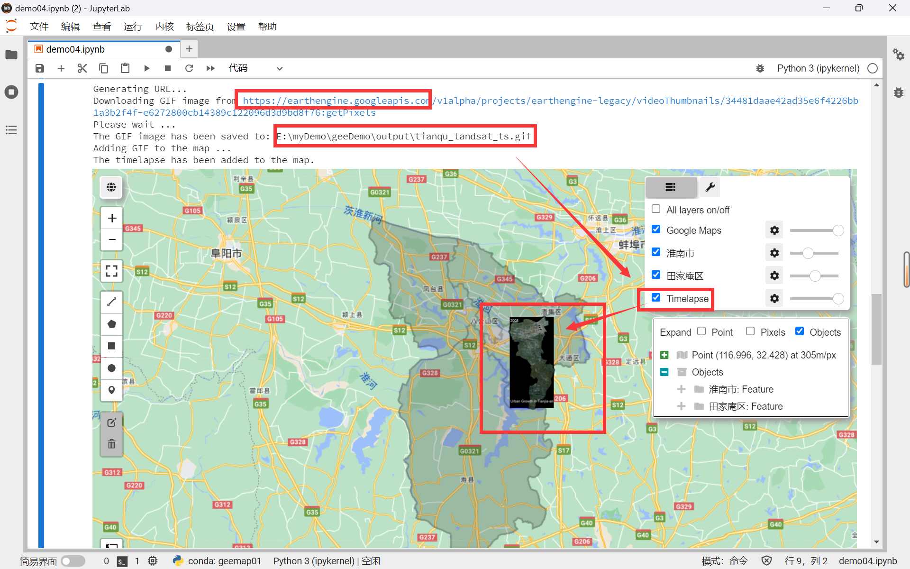
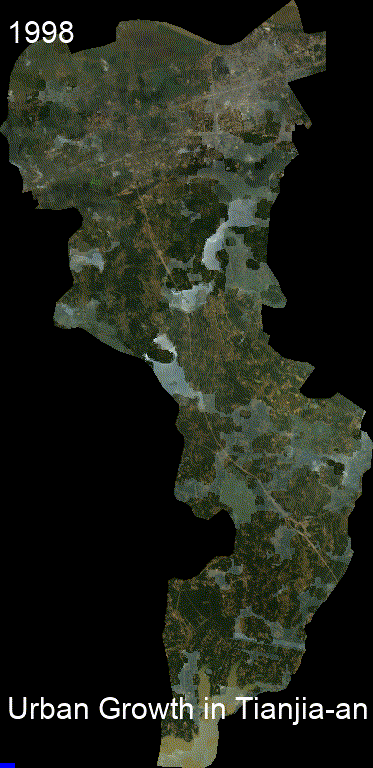
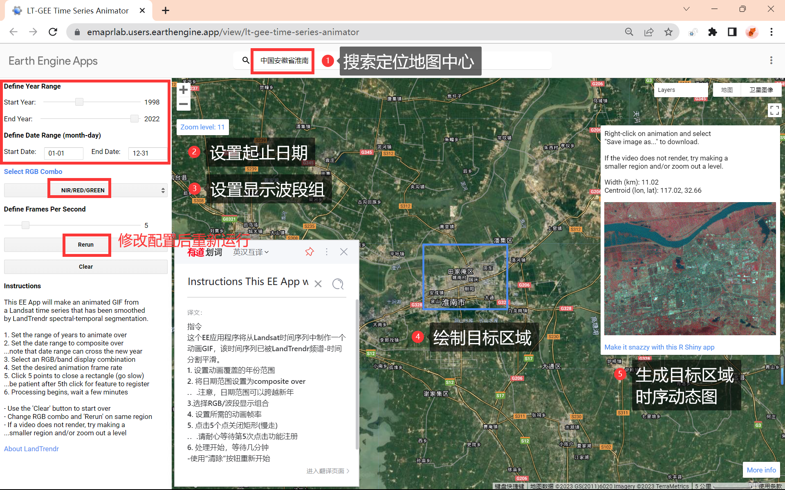

# Geemap 教程（二）：制作家乡40年变迁动画，看看你家乡有哪些变化？


## 相关参考

- [吴秋生 Geemap 教程 | 07 加载 GeoJson 文件](https://geemap.org/notebooks/07_geojson/)
- [吴秋生 Geemap 教程 | 16 添加 GIF 动画文字](https://geemap.org/notebooks/16_add_animated_text/)
- [吴秋生 Geemap 教程 | 18 创建 Landsat 影像时光流](https://geemap.org/notebooks/18_create_landsat_timelapse/)


## 前言

通过上节 [GEE 教程（四）](https://mp.weixin.qq.com/s?__biz=MzIxNDQ0NDY1NQ==&mid=2247496393&idx=1&sn=3e9510bf3e308636c1ce4d44fc663446&chksm=97a5cdc9a0d244df4fb5d39b7fcc96eaf13fd79e9de4e3cb37ee0852912e6f3b0630ed5701f1&cur_album_id=2463398802934808577&scene=189#wechat_redirect) 的内容，我们初步学习了 **<u>Geemap 包的基本使用</u>** 的基本操作，本篇教程中我们将继续学习 Geemap 包的进阶使用。

随着社会经济的发展，我们的家乡也发生了翻天覆地的变化，作为一个遥感领域的学习者，我们可以利用专业知识，使用卫星影像来记录家乡的变迁并用动画来展示家乡的发展。本篇教程以小编的家乡安徽省淮南市为例，利用 Landsat 影像制作一段 25 年的延时动画，展示安徽省淮南市田家庵区从 1998 年到 2022 年的城市化进程。

在本篇教程中，你将学习到以下内容：

- 如何使用 Geemap 包创建 Landsat 影像时光流
- 如何快速无代码创建目标区域的延时动画


## 1 前期准备

### 1.1 项目环境

开发工具：继续使用 [GEE 教程（三）](https://mp.weixin.qq.com/s?__biz=MzIxNDQ0NDY1NQ==&mid=2247496252&idx=1&sn=69e3a49a6748354c87133ecabfddfc3c&chksm=97a5cd3ca0d2442a760cdf90130ad0133c99610033abfcd64e4eae52ee72ba0adaa020036fd1&scene=178&cur_album_id=2650193990876659713#rd)中介绍的 JupyterLab Windows 桌面版

Python环境：继续使用  [GEE 教程（四）](https://mp.weixin.qq.com/s?__biz=MzIxNDQ0NDY1NQ==&mid=2247496393&idx=1&sn=3e9510bf3e308636c1ce4d44fc663446&chksm=97a5cdc9a0d244df4fb5d39b7fcc96eaf13fd79e9de4e3cb37ee0852912e6f3b0630ed5701f1&cur_album_id=2463398802934808577&scene=189#wechat_redirect) 中配置好的 `geemap01` 虚拟环境

### 1.2 项目目录结构

- `demo.ipynb`：项目文件
- `./input/`： 文件夹，用于存放相关输入文件
- `./output/`：文件夹，用于存放输入结果文件

Tips：

1. 最好使用 JupyterLab 桌面版 `v3.4.6-1` 版本，之后的新版本均存在渲染项目失败导致不显示地图的情况
2. 不要使用 conda 国内镜像更新 geemap，否则可能会把 jupyterlab 搞崩了

### 1.3 下载边界数据

进入 **==阿里云数字可视化平台==**：https://datav.aliyun.com/portal/school/atlas/area_selector 下载目标区域的边界数据，这里以小编的家乡安徽省淮南市为例，下载 `*.json` 格式的矢量数据。



<center>图 1-1 下载边界数据</center>

下载完成后，为防止在后续操作中由于中文编码导致意外的错误，我们需要先将下载好的文件名修改为：`huainan.json`，并将其放置在项目同目录下，本文使用的路径如下：

```
./input/huainan.json
```

### 1.4 加载矢量数据

接下来，我们使用 Geemap 包将本地的 GeoJSON 文件转换为 Earth Engine 对象并将其添加到地图图层，并显示出来，代码详细介绍如下：

- 存储淮南市的 GeoJSON 文件转换 Earth Engine 对象，并提取出田家庵区
- 创建 geemap 地图实例
- 添加图层：图层源数据、默认样式、图层名、不透明设置
- 显示中心：以加载数据为中心、缩放级别 9 级
- 显示地图

```python
huainan = geemap.geojson_to_ee("./input/huainan.json")
tianqu = huainan.filterMetadata('name', 'equals', '田家庵区')
Map = geemap.Map()
Map.addLayer(huainan, {}, '淮南市', opacity=0.35)
Map.addLayer(tianqu, {}, '田家庵区', opacity=0.5)
Map.centerObject(huainan, zoom=9)
Map
```



<center>图 1-2 矢量数据地图显示</center>


## 2 生成基于 Landsat 的时间序列 GIF 动图

### 2.1 创建输出目录

接下来，我们要使用 Geemap 包中的 `add_landsat_ts_gif()`  函数，此函数默认将结果下载到 C 盘缓存，不利于文件管理，所以我们给它指定的输出目录。

```python
work_dir = os.path.join(os.path.expanduser("."), 'output')
if not os.path.exists(work_dir):
    os.makedirs(work_dir)
   
out_gif = os.path.join(work_dir, "tianqu_landsat_ts.gif")
```

### 2.2 使用动画函数

要使用动画函数，除了设置输出目录外，我们还需要设置动画区域以及标题内容。

- 动画标题：淮南市城市扩张
- 动画区域：淮南市的几何边界
- 起始时间：1998年
- 显示波段组：RGB 真彩色

```
label = 'Urban Growth in Tianjia-an District'
roi = tianqu.geometry()
start_year = 1998
end_year = 2022
bands = ['Red', 'Green', 'Blue']
```

### 2.3 使用动画函数

设置好相关参数后，使用此函数即可向 GEE 服务器发送请求，并将计算结果返回到配置好的输出目录中，同时输出结果也会显示在地图上。

```python
Map.add_landsat_ts_gif(
    label=label,
    roi=roi,
    start_year=start_year,
    end_year=end_year,
    bands=bands,
    font_color='white',
    frames_per_second=5,
    progress_bar_color='blue',
    out_gif=out_gif
)
Map
```



<center>图 2-1 在地图上显示 GIF 动画</center>

### 2.4 动画演示



<center>图 2-2 田家庵区近 25 年 Landsat 影像时光流</center>

通过动画，尽管存在云层遮盖的影响，但是仍然不难看出，在市区的南部（淮南市山南新区）近25年内从无到有再到完善的城市扩张的全过程。

### 2.5 示例演示

下图是 Geemap 的创作者吴秋生教授给 `add_landsat_ts_gif()` 函数创建的示例结果。可以看出可视化效果很棒，有兴趣的小伙伴可以进一步深入研究如何使动画效果更加清晰，不受云层干扰。


<center>图 2-3 Landsat 影像时光流示例</center>


## 3 代码运行太麻烦？试试一键GIF吧！

如果想快速制作一张时序动态图，我们还可以直接使用 Justin Braaten 创建的 LT-GEE 时间序列动画器，从 GEE 地球引擎数据中一键创建GIF图像。

地址：[LT-GEE Time Series Animator (earthengine.app)](https://emaprlab.users.earthengine.app/view/lt-gee-time-series-animator)

使用它的好处在于：不需要魔法上网与GEE账户，可以直接生成结果。



下表是小编对该 GEE App 的 RGB 色彩组合的相关说明：

| 波段组                             | 作用                                                         | 适用场景                                 |
| ---------------------------------- | ------------------------------------------------------------ | ---------------------------------------- |
| Natural Color (TCB/TCG/TCW)        | 显示地表的自然色彩、植被覆盖和水分含量                       | 适用于自然景观、农业、水文等领域         |
| Shortwave Infrared (SWIR1/NIR/RED) | 显示地表的土壤、植被和城市特征，以及火灾、洪水和干旱等灾害   | 适用于土地利用、生态环境、灾害监测等领域 |
| Color Infrared (NIR/RED/GREEN)     | 显示地表的植被指数、土地利用和水体，以及冰雪、云和雾等现象   | 适用于植被生长、水资源、气象等领域       |
| True Color (RED/GREEN/BLUE)        | 显示地表的自然色彩、水体和阴影，以及大气散射和污染等效应     | 适用于基础制图、水质分析、大气研究等领域 |
| Agriculture (NIR/SWIR1/RED)        | 显示地表的植被健康度、土壤含水量和岩石矿物，以及火山、裸露地表和沙漠等特征 | 适用于植被分类、土壤湿度、矿产勘探等领域 |

