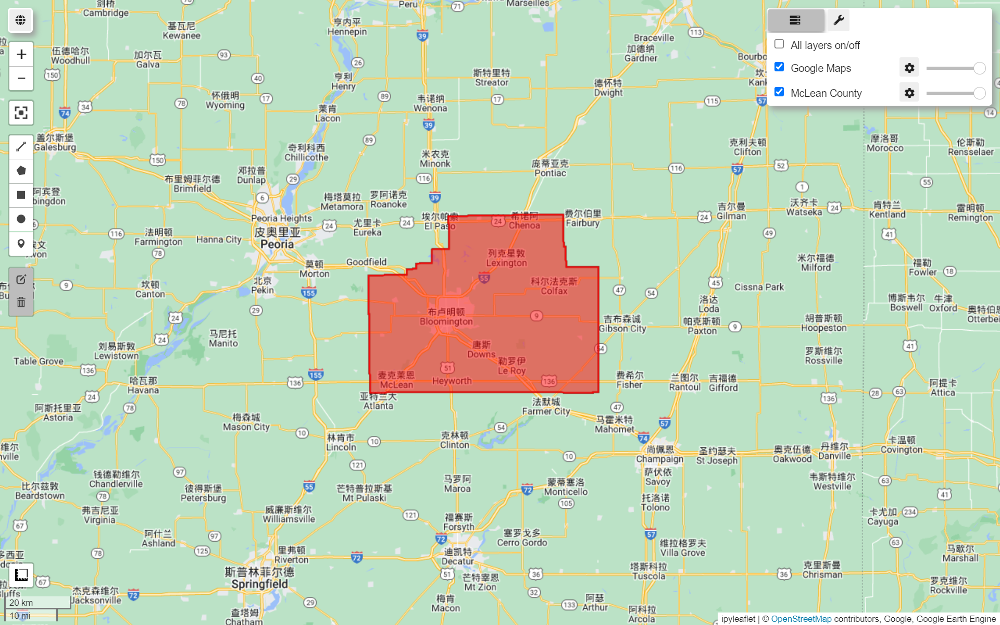
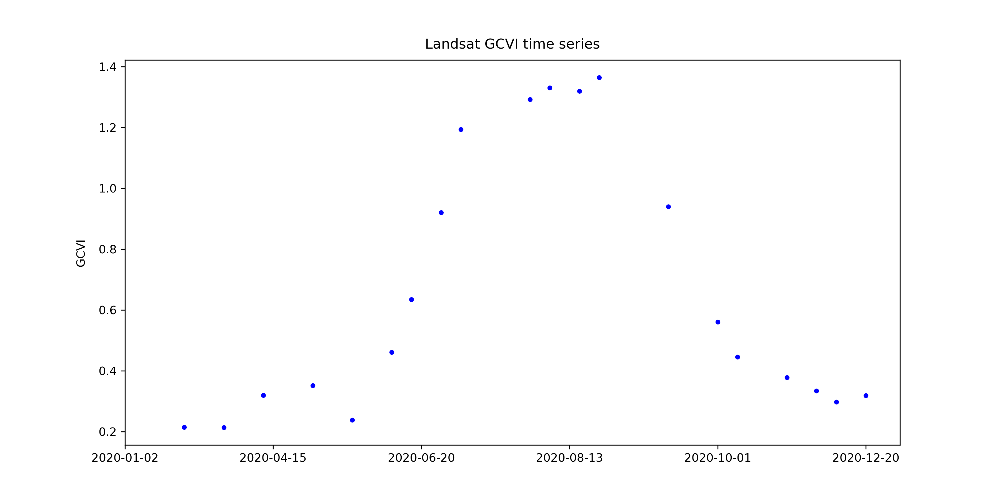
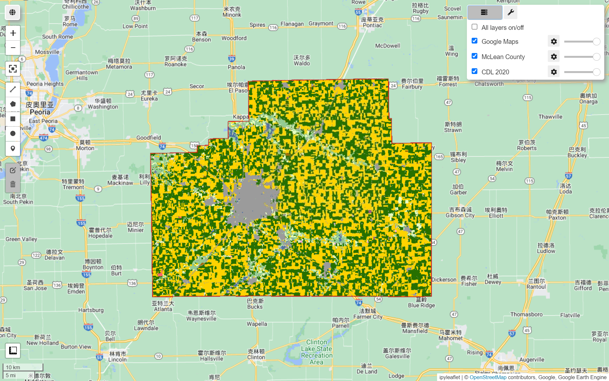

# Geemap 教程（六）：农作物分类可视化分析


## 前言

&emsp;&emsp;本章的目的是介绍如何使用 Earth Engine 中可用的数据集和函数绘制农业地图。我们将通过一个绘制美国中西部作物类型地图的示例，该地区是世界上主要的粮仓之一。本章中学到的技能将使您能够继续绘制其他农业特征图，例如产量和管理实践。


### 学习成果

- 使用农田数据层 (CDL) 作为标签对美国中西部县的作物类型进行分类。
- 使用 `ee.Reducer.linearRegression` 将二阶谐波回归拟合到裁剪时间序列并提取谐波系数。
- 使用绿色叶绿素植被指数 (GCVI) 进行作物类型分类。
- 训练随机森林根据调和系数对作物类型进行分类。
- 将经过训练的随机森林分类器应用于研究区域并评估其性能。


### 理论导论

&emsp;&emsp;农业是人类改变地球表面的主要方式之一。在全球范围内，约有 50 亿公顷（地球陆地面积的 38%）用于农业（粮农组织 2020）。其中大约三分之一用于种植农作物，而另外三分之二用于放牧牲畜。

&emsp;&emsp;面对不断增长的人口和不断变化的气候，有效管理土地资源比以往任何时候都更加重要，以便为所有人种植足够的食物，同时最大限度地减少对环境的破坏。为此，遥感为监测农业提供了重要的数据来源。由于大多数农业都是在户外进行的，卫星和飞机上的传感器可以捕捉到许多作物特征。

&emsp;&emsp;研究表明，作物随时间的光谱反射率可用于：

- 对作物类型进行分类（Wang 等人，2019 年）

- 预测产量（Burke 和 Lobell，2017 年）

- 检测作物胁迫（Ihuoma 和 Madramootoo，2017 年）

- 确定灌溉条件 (Deines 等人. 2017)

- 量化物种多样性 (Duro et al. 2014)

- 确定播种和收获日期 (Jain et al. 2016)

&emsp;&emsp;遥感图像也是精准农业兴起的关键，在精准农业中，管理实践在细微尺度上有所不同，以应对田地内作物需求的差异 (Azzari等人，2019; Jin等人，2017; Seifert等人，2018)。

&emsp;&emsp;衡量农业实践和成果的最终目标是提高产量和减少环境退化。


### 练习内容

&emsp;&emsp;在本次实习中，我们将使用 Earth Engine 提取 Landsat 图像并对美国中西部的作物类型进行分类。

&emsp;&emsp;美国是世界上最大的玉米生产国和第二大大豆生产国；因此，保持美国的高产量对于全球粮食安全和价格稳定至关重要。

&emsp;&emsp;作物类型测绘是使用卫星图像估算农业产量的重要先决条件。我们将展示：

&emsp;&emsp;1、如何通过拟合调和回归和提取系数从时间序列中获取特征

&emsp;&emsp;2、然后我们将使用随机森林对作物类型进行分类：

- 其中 `"ground truth"` 标签将来自美国农业部的农田数据层（CDL）
- CDL 本身是使用卫星图像作为输入并使用基于调查的地面实况作为训练标签的分类器的产物 (USDA 2021)

&emsp;&emsp;3、我们在美国中西部演示作物类型分类，因为 CDL 允许我们验证我们的预测。

&emsp;&emsp;虽然使用卫星图像绘制作物类型地图已经在美国投入使用，但绘制作物类型地图在世界大部分地区仍然是一个公开的挑战。


## 1 提取研究区域所有 Landsat 影像

&emsp;&emsp;在中西部，玉米和大豆占主导地位。我们将绘制伊利诺伊州麦克莱恩县的农作物类型图。这是美国玉米和大豆产量最多的县，分别为 62.9 和 1930 万 **蒲式耳**（Bushels）。

### 1.1 定义研究区域并将其可视化

&emsp;&emsp;首先，我们定义研究区域并将其可视化（图 A1.1.1）。我们从 ***美国人口普查局的 TIGER 数据集*** 中获取县边界，该数据集可在 Earth Engine 数据目录中找到。

&emsp;&emsp;使用伊利诺伊州的 FIPS 码 (`STATEFP=17`) 和麦克莱恩县的名称 (`Name=McLean`)，从 TIGER 中提取麦克莱恩县特征。

```python
TIGER = ee.FeatureCollection('TIGER/2018/Counties')
region = ee.Feature(TIGER.filter(ee.Filter.eq('STATEFP', '17')) \
                  .filter(ee.Filter.eq('NAME', 'McLean')) \
                  .first()).geometry()
Map = geemap.Map()
Map.centerObject(region)
Map.addLayer(region,{
   'color': 'red'
}, 'McLean County')
Map
```



<center>图 A1.1.1 伊利诺伊州麦克莱恩县的位置和边界</center>

### 1.2 加载 Landsat  L2 级影像

&emsp;&emsp;接下来，我们导入 Landsat 7 和 8 图像，我们使用 Level-2 数据，其中包含经大气校正的表面反射率和地表温度。虽然大气顶层数据也会为许多农业应用产生良好的结果，但我们更喜欢在可用时针对大气条件进行了校正的数据，因为大气变化只是输入中的另一个噪声源。

```python
landsat7 = ee.ImageCollection('LANDSAT/LE07/C02/T1_L2')
landsat8 = ee.ImageCollection('LANDSAT/LC08/C02/T1_L2')
```

### 1.3 重命名 Landsat 波段

&emsp;&emsp;由于 Landsat 7 和 8 的传感器不同，导致各自的 Level-2 数据产品的波段编号也不同。

<center>表 A1.1.1 Landsat 7 和 8 L2 级数据产品对比</center>

| 数据产品     | 数据可用性      | 传感器   | 地表反射率波段 |
| ------------ | --------------- | -------- | -------------- |
| Landsat 7 L2 | 1999-05-28 ~ 今 | ETM+     | 7 个           |
| Landsat 8 L2 | 2013-03-18 ~ 今 | OLI/TIRS | 8 个           |

&emsp;&emsp;为了可以更轻松地同时处理 Landsat 7 和 8 数据，我们定义两个函数 `renameL7()` 和 `renameL8()` 将 Landsat 7 或 Landsat 8 数据的波段重命名为更直观的名称。

&emsp;&emsp;例如，我们没有将 Landsat 7 图像的第一个波段称为 “B1” ，而是将其重命名为 “BLUE” ，因为波段 1 捕获可见光谱蓝色部分的光。

```python
def renameL7(img):
    img = img.rename([
        'BLUE', 'GREEN', 'RED', 'NIR',
        'SWIR1', 'SWIR2', 'TEMP1',
        'ATMOS_OPACITY', 'QA_CLOUD',
        'ATRAN', 'CDIST',
        'DRAD', 'EMIS', 'EMSD', 'QA', 'TRAD', 'URAD',
        'QA_PIXEL', 'QA_RADSAT'
    ])
    return img

def renameL8(img):
    img = img.rename([
        'AEROS',
        'BLUE', 'GREEN', 'RED', 'NIR',
        'SWIR1', 'SWIR2', 'TEMP1',
        'QA_AEROSOL',
        'ATRAN', 'CDIST',
        'DRAD', 'EMIS', 'EMSD', 'QA', 'TRAD', 'URAD',
        'QA_PIXEL', 'QA_RADSAT'
    ])
    return img
```

### 1.4  去云掩膜

&emsp;&emsp;下面，我们定义了两个函数：

- `addMask()` 函数：将 `QA_PIXEL` 位掩码转换为多个掩码层
- `maskQAClear()`  函数：从每个图像中删除所有非透明像素

```python
def addMask(img):
    # Bit 0: Fill
    # Bit 1: Dilated Cloud
    # Bit 2: Cirrus (high confidence) (L8) or unused (L7)
    # Bit 3: Cloud
    # Bit 4: Cloud Shadow
    # Bit 5: Snow
    # Bit 6: Clear
    #        0: Cloud or Dilated Cloud bits are set
    #        1: Cloud and Dilated Cloud bits are not set
    # Bit 7: Water
    clear = img.select('QA_PIXEL').bitwiseAnd(64).neq(0)
    clear = clear.updateMask(clear).rename(['pxqa_clear'])

    water = img.select('QA_PIXEL').bitwiseAnd(128).neq(0)
    water = water.updateMask(water).rename(['pxqa_water'])

    cloud_shadow = img.select('QA_PIXEL').bitwiseAnd(16).neq(0)
    cloud_shadow = cloud_shadow.updateMask(cloud_shadow).rename([
       'pxqa_cloudshadow'
    ])

    snow = img.select('QA_PIXEL').bitwiseAnd(32).neq(0)
    snow = snow.updateMask(snow).rename(['pxqa_snow'])

    masks = ee.Image.cat([
       clear, water, cloud_shadow, snow
    ])
    return img.addBands(masks)

def maskQAClear(img):
    return img.updateMask(img.select('pxqa_clear'))
```

### 1.5 计算并添加 GCVI 波段

&emsp;&emsp;除了ETM+和OLI感知的原始波段外，植被指数（VI）也可以帮助区分不同的植被类型。先前的工作发现，绿色叶绿素植被指数 (GCVI) 对于在中西部地区区分玉米和大豆特别有用（Wang 等人，2019 年）。我们将把它作为波段添加到每个 Landsat 图像中。

```python
def addGCVI(img):
    gcvi = img.expression(
        '(nir / green) - 1',
        {
            'nir': img.select('NIR'),
            'green': img.select('GREEN')
        }).select([0], ['GCVI'])
    return ee.Image.cat([img, gcvi])
```

### 1.6  筛选数据

&emsp;&emsp;现在我们准备为我们的研究区域提取 Landsat 7 和 8 数据并应用上述功能。我们将访问 2020 年 1 月 1 日至 12 月 31 日与麦克莱恩县相交的所有图像。由于不同的作物具有不同的生长特性，因此获取时间序列图像以区分作物何时生长、何时衰老和何时收获是有价值的。各个时间点的光谱反射率差异也可以提供信息。

```python
start_date = '2020-01-01'
end_date = '2020-12-31'

# 筛选出起止日期间研究区域的Landsat 7 和 8 数据
landsat7coll = landsat7.filterBounds(region) \
	.filterDate(start_date, end_date) \
    .map(renameL7)

landsat8coll = landsat8.filterBounds(region) \
	.filterDate(start_date, end_date) \
	.map(renameL8)
```

&emsp;&emsp;接下来，我们合并 Landsat 7 和 Landsat 8 集合，屏蔽云层，并将 GCVI 添加为波段。

```python
landsat = landsat7coll.merge(landsat8coll) \
    .sort('system:time_start')

# 屏蔽不清晰的像素，添加 GCVI 和 time 变量
landsat = landsat.map(addMask) \
    .map(maskQAClear) \
    .map(addGCVI)
```

### 1.7 图表可视化

&emsp;&emsp;根据 CDL 的说法，我们可以使用 matplotlib 可视化特定点上的联合 Landsat GCVI 时间序列，在这种情况下，该点落在玉米田里。

```python
point = ee.Geometry.Point([
    -88.81417685576481,
    40.579804398254005
])
# 定义一个函数，用于对每个影像该点的 GCVI 值
# 并返回一个包含 GCVI 值和时间属性的Feature
def get_gcvi_and_date(image):
    # 获取某一点上的 GCVI 值
    gcvi = image.select('GCVI').reduceRegion(ee.Reducer.first(), point)
    # 获取影像的日期，使用ee.Date()方法，并格式化为YYYY-MM-dd
    date = ee.Date(image.get('system:time_start')).format('YYYY-MM-dd')
    # 返回一个包含 GCVI 值和时间属性的要素
    return ee.Feature(point, {'date': date, 'gcvi': gcvi})

# 使用ee.ImageCollection.map()方法来对影像集合中每个影像应用上面定义的函数
# map()函数返回的是一个ee.ComputedObject类型的对象
# 需要将结果转化为ee.FeatureCollection
gcvi_val = ee.FeatureCollection(landsat.map(get_gcvi_and_date))
```

&emsp;&emsp;将数据导出到 excel 表中

```python
df = geemap.ee_to_pandas(gcvi_val)
df['date'] = pd.to_datetime(df['date'], format='%Y-%m-%d')
# 使用apply()方法来获取每个字典中的GCVI值
df['gcvi'] = df['gcvi'].apply(lambda x: x['GCVI'])
# 将gcvi列中的空值设置为NaN
df['gcvi'] = df['gcvi'].replace('', np.nan)
GCVI_output = './output/gcvi_chart.xlsx'
df.to_excel(GCVI_output, index=False)
```

| date                 | gcvi     |
| -------------------- | -------- |
| 2020-01-02  00:00:00 |          |
| 2020-01-19  00:00:00 |          |
| 2020-01-26  00:00:00 |          |
| 2020-02-03  00:00:00 |          |
| 2020-02-11  00:00:00 |          |
| 2020-02-19  00:00:00 |          |
| 2020-02-20  00:00:00 | 0.214667 |

&emsp;&emsp;我们可以使用 matplotlib 包来可视化特定点上的综合 Landsat GCVI 时间序列，在本例中，该点位于玉米地

```python
GCVI_df = pd.read_excel(GCVI_output)

plt.figure(figsize=(12, 6))
GCVI_df['date'] = GCVI_df['date'].dt.strftime('%Y-%m-%d')
# 将gcvi列中的空值设置为NaN
GCVI_df['gcvi'] = GCVI_df['gcvi'].replace('', np.nan)

# 绘制散点折线图，使用日期作为x轴，GCVI值作为y轴，设置散点大小为10
plt.scatter(GCVI_df['date'], GCVI_df['gcvi'], label='GCVI', color='blue', s=10)
plt.xticks(np.arange(0, len(df), 15))
plt.title('Landsat GCVI time series')

# 保存图形为一个png文件，分辨率为300dpi，要放在图像绘制之前
out_file = "./output/Landsat_GCVI_time_series.png"
plt.savefig(out_file, dpi=300)
plt.show()
```



<center>图 A1.1.2 Landsat GCVI 时间序列在伊利诺伊州麦克林县玉米点的可视化。GCVI越高，叶片叶绿素含量越高；庄稼在六月变绿，九月衰老。</center>


### 1.8 获取作物类型数据集

&emsp;&emsp;最后，我们还要看一下我们将用来训练和评估分类器的作物类型数据集。我们加载 2020 年的 CDL 图像并选择包含作物类型信息的图层。

```python
cdl = ee.Image('USDA/NASS/CDL/2020').select(['cropland'])
Map.addLayer(cdl.clip(geometry), {}, 'CDL 2020')
Map
```

&emsp;&emsp;在 CDL 中，玉米田以黄色显示，大豆田以绿色显示（图 A1.1.3）。



<center>图 A1.1.3 CDL对伊利诺斯州麦克莱恩县进行了可视化。玉米田用黄色表示，大豆田用深绿色表示。其他土地覆盖类型包括灰色的城市地区、蓝绿色的落叶森林和蓝色的水域。</center>


## 2 向 Landsat 影像添加进行谐波回归后的波段

&emsp;&emsp;现在我们有了一个影像集合，其中包含 2020 年麦克莱恩县所有可用的 Landsat 图像，我们可以从时间序列中提取特征以进行作物类型分类。

&emsp;&emsp;调和回归是一种通过将正弦和余弦函数拟合到时间序列来提取特征的方法。也称为 ==***傅里叶变换***==，调和回归特别适用于定期重复出现的数据模式。特别是，我们拟合二阶调和回归，其形式为：

$$
f(t)=a_1\cos(2\pi\omega t)+b_1\sin(2\pi\omega t)+a_2\cos(4\pi\omega t)+b_2\sin(4\pi\omega t)+c
\tag*{A(1.1.1)}
$$

- $t$ 为时间变量
- $f(t)$ 是要拟合的观测变量
- $a、b、c$ 是通过回归找到的系数
- $ω$ 是控制谐波基周期的超参数，对于本练习，我们将使用 $ω=1$


### 2.1 为图像添加时间带

&emsp;&emsp;为了准备集合，我们定义了两个函数，它们向 ImageCollection 添加调和基与截距。

&emsp;&emsp;第一个函数以年为单位将每幅图像的采集时间作为波段添加到图像中。该函数将图像和参考日期作为参数；新时间段是相对于此参考日期计算的。

```python
def addTimeUnit(image, refdate):
   date = image.date()
   dyear = date.difference(refdate, 'year')
   t = image.select(0).multiply(0).add(dyear).select([0], ['t']).float()
   imageplus = image.addBands(t)
   return imageplus
```

### 2.2 向图像添加谐波基

&emsp;&emsp;第二个函数先调用 `addTimeUnit()`，然后获取每张图像采集时间的正弦和余弦，并将它们作为新波段添加到每个图像。我们正在拟合二阶谐波回归，因此我们将添加两个正弦项和两个余弦项作为频带，以及一个常数项。该函数还允许使用 $ω$ (omega) 的任何值。

&emsp;&emsp;需要注意的是，为了创建 “constant” 波段，我们将时间波段本身分开；这将得到一个值为 1 的波段，并且掩码与time波段相同。

```python
def addHarmonics(image, omega, refdate):
    image = addTimeUnit(image, refdate)
    timeRadians = image.select('t').multiply(2 * math.pi * omega)
    timeRadians2 = image.select('t').multiply(4 * math.pi * omega)

    return image.addBands(timeRadians.cos().rename('cos')) \
        .addBands(timeRadians.sin().rename('sin')) \
        .addBands(timeRadians2.cos().rename('cos2')) \
        .addBands(timeRadians2.sin().rename('sin2')) \
        .addBands(timeRadians.divide(timeRadians).rename('constant'))
```

我们拥有将正弦和余弦项添加到每个图像所需的所有工具——我们只需使用 `map()` 将 `addHarmonics()` 应用到集合中的每个图像。我们使用2020年1月1日的 `start_date` 作为参考日期。

```python
omega = 1
def use_addHarmonics(image):
    return addHarmonics(image, omega, start_date)
landsatPlus = landsat.map(use_addHarmonics)
print('Landsat collection with harmonic basis: ', landsatPlus)
```


## 相关参考

[Gee-tutorials | Human Applications |Agricultural Environments (google-earth-engine.com)](https://google-earth-engine.com/Human-Applications/Agricultural-Environments/)

```
&emsp;&emsp;
```

