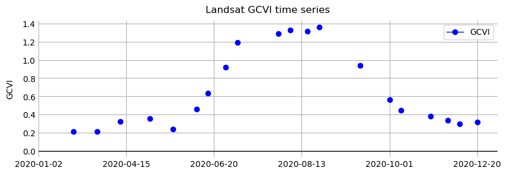
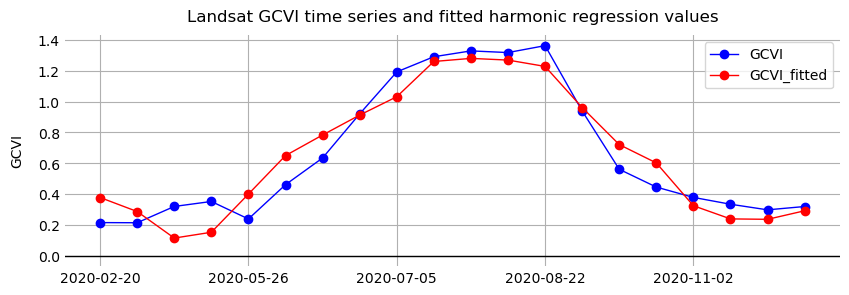
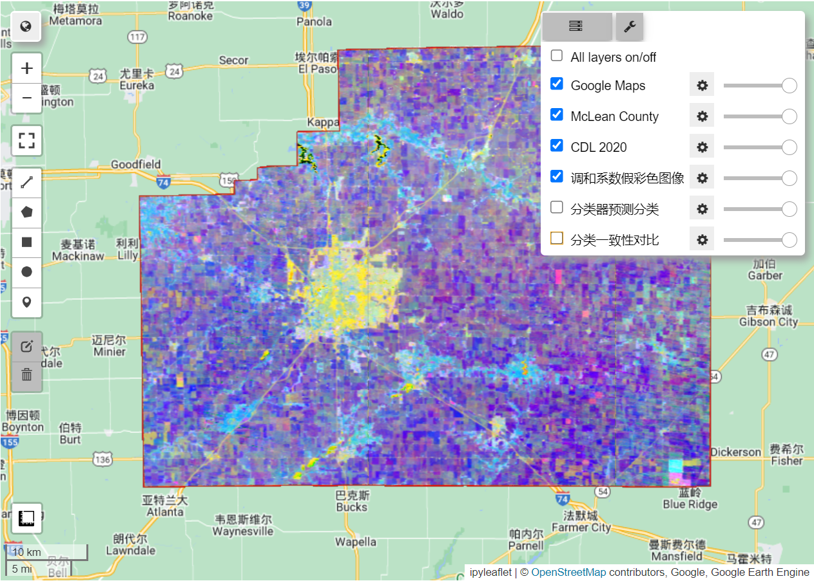
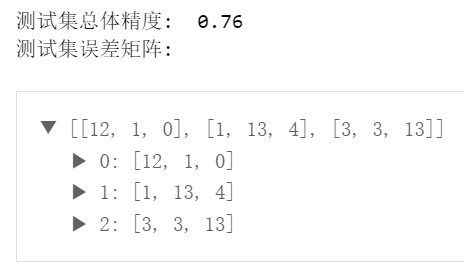
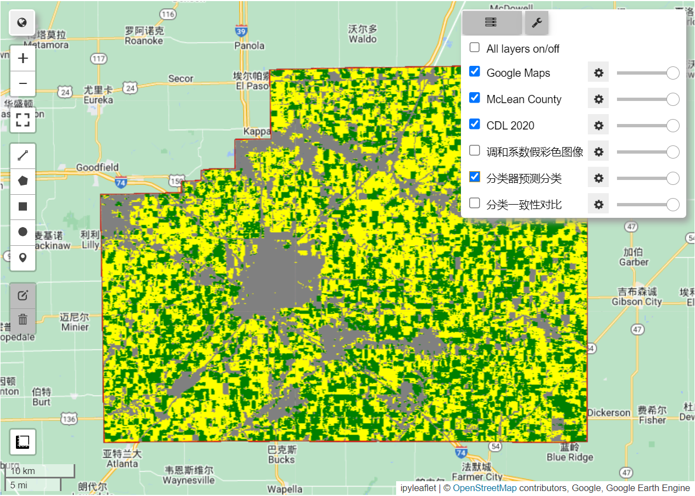
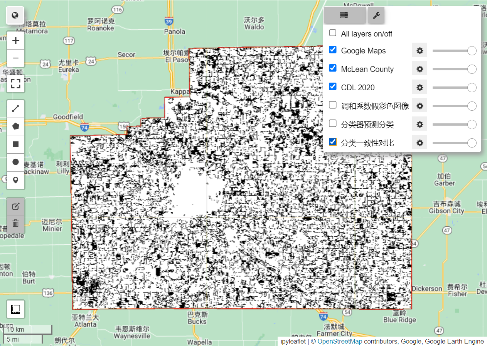

# Geemap 教程（六）：农作物分类可视化分析——以玉米和大豆为例


## 前言

&emsp;&emsp;本文的目的是介绍如何利用 Geemap 使用 Google Earth Engine（以下简称为 GEE）中可用的数据集和函数绘制农业地图。将通过一个绘制美国中西部作物类型地图的示例，该地区是世界上主要的粮仓之一。本文的研究方法也适用于绘制其他农业特征图，例如产量和管理实践。


### 学习成果

- 使用农田数据层 (CDL) 作为标签对美国中西部县的作物类型进行分类。
- 使用 `ee.Reducer.linearRegression` 将二阶谐波回归拟合到裁剪时间序列并提取谐波系数。
- 使用绿色叶绿素植被指数 (GCVI) 进行作物类型分类。
- 训练随机森林根据调和系数对作物类型进行分类。
- 将经过训练的随机森林分类器应用于研究区域并评估其性能。


### 理论导论

&emsp;&emsp;农业是人类改变地球表面的主要方式之一。在全球范围内，约有 50 亿公顷（地球陆地面积的 38%）用于农业（粮农组织 2020）。其中大约三分之一用于种植农作物，而另外三分之二用于放牧牲畜。

&emsp;&emsp;面对不断增长的人口和不断变化的气候，有效管理土地资源比以往任何时候都更加重要，以便为所有人种植足够的食物，同时最大限度地减少对环境的破坏。为此，遥感为监测农业提供了重要的数据来源。由于大多数农业都是在户外进行的，卫星和飞机上的传感器可以捕捉到许多作物特征。

&emsp;&emsp;研究表明，作物随时间的光谱反射率可用于：

- 对作物类型进行分类（Wang 等人，2019 年）

- 预测产量（Burke 和 Lobell，2017 年）

- 检测作物胁迫（Ihuoma 和 Madramootoo，2017 年）

- 确定灌溉条件 (Deines 等人. 2017)

- 量化物种多样性 (Duro et al. 2014)

- 确定播种和收获日期 (Jain et al. 2016)

&emsp;&emsp;遥感图像也是精准农业兴起的关键，在精准农业中，管理实践在细微尺度上有所不同，以应对田地内作物需求的差异 (Azzari等人，2019; Jin等人，2017; Seifert等人，2018)。衡量农业实践和成果的最终目标是提高产量和减少环境退化。


### 研究内容

&emsp;&emsp;本文将使用 GEE 与 Geemap 提取 Landsat 图像并对美国中西部的作物类型进行分类。

&emsp;&emsp;美国是世界上最大的玉米生产国和第二大大豆生产国；因此，保持美国的高产量对于全球粮食安全和价格稳定至关重要。

&emsp;&emsp;作物类型测绘是使用卫星图像估算农业产量的重要先决条件。本文将展示：

&emsp;&emsp;1、如何通过拟合调和回归和提取系数从时间序列中获取特征

&emsp;&emsp;2、然后本文将使用随机森林对作物类型进行分类：

- 其中 `"ground truth"` 标签来自美国农业部的农田数据层（CDL）
- CDL 本身是使用卫星图像作为输入并使用基于调查的地面实况作为训练标签的分类器的产物 (USDA 2021)

&emsp;&emsp;3、本文在美国中西部演示作物类型分类，以 CDL 数据支撑本文预测数据的验证。

&emsp;&emsp;虽然使用卫星图像绘制作物类型地图已经在美国投入使用，但绘制作物类型地图在世界大部分地区仍然是一个公开的挑战。


## 1 提取研究区域所有 Landsat 影像

&emsp;&emsp;在美国中西部，玉米和大豆占主导地位。本文将绘制伊利诺伊州麦克莱恩县的农作物类型图。这是美国玉米和大豆产量最多的县，分别为 62.9 和 1930 万 **蒲式耳**（Bushels）。

### 1.1 定义研究区域并将其可视化

&emsp;&emsp;首先，定义研究区域并将其可视化（图 1-1），从 ***美国人口普查局的 TIGER 数据集*** 中获取县边界，该数据集可在 GEE 数据目录中找到。

&emsp;&emsp;使用伊利诺伊州的 FIPS 码 (`STATEFP=17`) 和麦克莱恩县的名称 (`Name=McLean`)，从 TIGER 中提取麦克莱恩县特征，并将其在地图控件中进行可视化。

```python
TIGER = ee.FeatureCollection('TIGER/2018/Counties')
region = ee.Feature(TIGER.filter(ee.Filter.eq('STATEFP', '17')) \
                  .filter(ee.Filter.eq('NAME', 'McLean')) \
                  .first()).geometry()
Map = geemap.Map()
Map.centerObject(region)
Map.addLayer(region,{
   'color': 'red'
}, 'McLean County')
Map
```


<center>图 1-1 伊利诺伊州麦克莱恩县的位置和边界</center>

### 1.2 加载 Landsat  L2 级影像

&emsp;&emsp;接下来，导入 Landsat 7 和 8 图像，使用 Level-2 数据，其中包含经大气校正的表面反射率和地表温度。虽然大气顶层数据也会为许多农业应用产生良好的结果，针对大气条件进行了校正的数据使用效果会更好，因为大气变化是输入数据中的一个噪声源。

```python
landsat7 = ee.ImageCollection('LANDSAT/LE07/C02/T1_L2')
landsat8 = ee.ImageCollection('LANDSAT/LC08/C02/T1_L2')
```

### 1.3 重命名 Landsat 波段

&emsp;&emsp;由于 Landsat 7 和 8 的传感器不同，导致各自的 Level-2 数据产品的波段编号也不同。

<center>表 1-1 Landsat 7 和 8 L2 级数据产品对比</center>

| 数据产品     | 数据可用性      | 传感器   | 地表反射率波段 |
| ------------ | --------------- | -------- | -------------- |
| Landsat 7 L2 | 1999-05-28 ~ 今 | ETM+     | 7 个           |
| Landsat 8 L2 | 2013-03-18 ~ 今 | OLI/TIRS | 8 个           |

&emsp;&emsp;为了可以更轻松地同时处理 Landsat 7 和 8 数据，本文定义两个函数 `renameL7()` 和 `renameL8()` 将 Landsat 7 或 Landsat 8 数据的波段重命名为更直观的名称。

&emsp;&emsp;例如，没有将 Landsat 7 图像的第一个波段称为 “B1” ，而是将其重命名为 “BLUE” ，因为波段 1 捕获可见光谱蓝色部分的光。

```python
def renameL7(img):
    img = img.rename([
        'BLUE', 'GREEN', 'RED', 'NIR',
        'SWIR1', 'SWIR2', 'TEMP1',
        'ATMOS_OPACITY', 'QA_CLOUD',
        'ATRAN', 'CDIST',
        'DRAD', 'EMIS', 'EMSD', 'QA', 'TRAD', 'URAD',
        'QA_PIXEL', 'QA_RADSAT'
    ])
    return img

def renameL8(img):
    img = img.rename([
        'AEROS',
        'BLUE', 'GREEN', 'RED', 'NIR',
        'SWIR1', 'SWIR2', 'TEMP1',
        'QA_AEROSOL',
        'ATRAN', 'CDIST',
        'DRAD', 'EMIS', 'EMSD', 'QA', 'TRAD', 'URAD',
        'QA_PIXEL', 'QA_RADSAT'
    ])
    return img
```

### 1.4  去云掩膜

&emsp;&emsp;下面定义了两个函数，它们分别是：

- `addMask()` 函数：将 `QA_PIXEL` 位掩码转换为多个掩码层
- `maskQAClear()`  函数：从每个图像中删除所有非透明像素

```python
def addMask(img):
    # Bit 0: Fill
    # Bit 1: Dilated Cloud
    # Bit 2: Cirrus (high confidence) (L8) or unused (L7)
    # Bit 3: Cloud
    # Bit 4: Cloud Shadow
    # Bit 5: Snow
    # Bit 6: Clear
    #        0: Cloud or Dilated Cloud bits are set
    #        1: Cloud and Dilated Cloud bits are not set
    # Bit 7: Water
    clear = img.select('QA_PIXEL').bitwiseAnd(64).neq(0)
    clear = clear.updateMask(clear).rename(['pxqa_clear'])

    water = img.select('QA_PIXEL').bitwiseAnd(128).neq(0)
    water = water.updateMask(water).rename(['pxqa_water'])

    cloud_shadow = img.select('QA_PIXEL').bitwiseAnd(16).neq(0)
    cloud_shadow = cloud_shadow.updateMask(cloud_shadow).rename([
       'pxqa_cloudshadow'
    ])

    snow = img.select('QA_PIXEL').bitwiseAnd(32).neq(0)
    snow = snow.updateMask(snow).rename(['pxqa_snow'])

    masks = ee.Image.cat([
       clear, water, cloud_shadow, snow
    ])
    return img.addBands(masks)

def maskQAClear(img):
    return img.updateMask(img.select('pxqa_clear'))
```

### 1.5 计算并添加 GCVI 波段

&emsp;&emsp;除了ETM+和OLI感知的原始波段外，植被指数（VI）也可以帮助区分不同的植被类型。先前的工作发现，绿色叶绿素植被指数 (GCVI) 对于在中西部地区区分玉米和大豆特别有用（Wang 等人，2019 年）。现在把它作为波段添加到每张 Landsat 图像中。

```python
def addGCVI(img):
    gcvi = img.expression(
        '(nir / green) - 1',
        {
            'nir': img.select('NIR'),
            'green': img.select('GREEN')
        }).select([0], ['GCVI'])
    return ee.Image.cat([img, gcvi])
```

### 1.6  筛选数据

&emsp;&emsp;然后，提取在研究区域上的 Landsat 7 和 8 数据并应用上述函数。筛选出 2020 年 1 月 1 日至 12 月 31 日与麦克莱恩县相交的所有图像。由于不同的作物具有不同的生长特性，因此获取时间序列图像以区分作物何时生长、何时衰老和何时收获是有价值的。各个时间点的光谱反射率差异也可以提供信息。

```python
start_date = '2020-01-01'
end_date = '2020-12-31'

# 筛选出起止日期间研究区域的Landsat 7 和 8 数据
landsat7coll = landsat7.filterBounds(region) \
	.filterDate(start_date, end_date) \
    .map(renameL7)

landsat8coll = landsat8.filterBounds(region) \
	.filterDate(start_date, end_date) \
	.map(renameL8)
```

&emsp;&emsp;接下来，合并 Landsat 7 和 Landsat 8 集合，屏蔽云层，并将 GCVI 添加为一个波段。

```python
landsat = landsat7coll.merge(landsat8coll).sort('system:time_start')

landsat = landsat.map(addMask).map(maskQAClear).map(addGCVI)
```

### 1.7 图表可视化

&emsp;&emsp;使用 matplotlib 可视化特定点上的 Landsat GCVI 时间序列图，这里设置该点落在玉米田里。首先，需要把提取该点上每张影像的 GCVI 值生成一个要素集合类型的数据。

```python
point = ee.Geometry.Point([-88.81417685576481, 40.579804398254005])

def get_gcvi_and_date(image):
    gcvi = image.select('GCVI').reduceRegion(ee.Reducer.first(), point)
    date = ee.Date(image.get('system:time_start')).format('YYYY-MM-dd')
    return ee.Feature(point, {'date': date, 'gcvi': gcvi})

gcvi_val = ee.FeatureCollection(landsat.map(get_gcvi_and_date))
```

&emsp;&emsp;然后将要素集合数据用 `geemap.ee_to_pandas()` 方法转化为 DataFrame 格式，再用 pandas 包将其导出到 excel 表中，得到了一个包含该点所有 GCVI 数据的表格，表格部分数据如表 1-2 所示。

```python
df = geemap.ee_to_pandas(gcvi_val)
df['date'] = pd.to_datetime(df['date'], format='%Y-%m-%d')
df['gcvi'] = df['gcvi'].apply(lambda x: x['GCVI'])
df['gcvi'] = df['gcvi'].replace('', np.nan)
GCVI_output = './output/gcvi_chart.xlsx'
df.to_excel(GCVI_output, index=False)
```

<center>表 1-2 GCVI 部分数据</center>

| date                 | gcvi     |
| -------------------- | -------- |
| 2020-01-02  00:00:00 |          |
| 2020-01-19  00:00:00 |          |
| 2020-01-26  00:00:00 |          |
| 2020-02-03  00:00:00 |          |
| 2020-02-11  00:00:00 |          |
| 2020-02-19  00:00:00 |          |
| 2020-02-20  00:00:00 | 0.214667 |

&emsp;&emsp;最后使用 pandas 读取导出后 excel 表格，并使用 matplotlib 包绘制出 Landsat GCVI 时间序列折线图。

```python
GCVI_df = pd.read_excel(GCVI_output)

plt.figure(figsize=(10, 3))
GCVI_df['date'] = GCVI_df['date'].dt.strftime('%Y-%m-%d')
GCVI_df['gcvi'] = GCVI_df['gcvi'].replace('', np.nan)

plt.plot(GCVI_df['date'], GCVI_df['gcvi'], 'b-', marker='o', linewidth=1.0)
plt.ylabel('GCVI', labelpad=10)
plt.xticks(np.arange(0, len(GCVI_df), 15))
plt.title('Landsat GCVI time series', pad=10)
plt.grid(True)
plt.box(False)
plt.axhline(0, color='black', linewidth=1.0)
plt.tick_params(axis='both', length=0)
plt.legend(['GCVI'])

out_file = "./output/Landsat_GCVI_time_series.png"
plt.savefig(out_file, dpi=300)
plt.show()
```



<center>图 1-2 Landsat GCVI 时间序列在伊利诺伊州麦克林县玉米点的可视化。GCVI越高，叶片叶绿素含量越高；庄稼在六月变绿，九月衰老。</center>

### 1.8 获取作物类型数据集

&emsp;&emsp;最后，查看一下将用来训练和评估分类器的作物类型数据集，加载 2020 年的 CDL 图像并选择包含作物类型信息的图层。

```python
cdl = ee.Image('USDA/NASS/CDL/2020').select(['cropland'])
Map.addLayer(cdl.clip(geometry), {}, 'CDL 2020')
Map
```

&emsp;&emsp;在 CDL 中，玉米田以黄色显示，大豆田以绿色显示（图 3）。


<center>图 1-3 CDL对伊利诺斯州麦克莱恩县进行了可视化。玉米田用黄色表示，大豆田用深绿色表示。其他土地覆盖类型包括灰色的城市地区、蓝绿色的落叶森林和蓝色的水域。</center>


问题1：2020年 Landsat 7号和 Landsat 8号在麦克莱恩县拍摄了多少图像？


问题2：通过使用 `ui.chart`，你能定性地发现玉米田和大豆田的时间序列之间的任何差异吗？


## 2 向 Landsat 影像添加进行谐波回归后的波段

&emsp;&emsp;现在有了一个影像集合，其中包含 2020 年麦克莱恩县所有可用的 Landsat 图像，我们可以从时间序列中提取特征以进行作物类型分类。

&emsp;&emsp;调和回归是一种通过将正弦和余弦函数拟合到时间序列来提取特征的方法。也称为 ==***傅里叶变换***==，调和回归特别适用于定期重复出现的数据模式。特别是，我们拟合二阶调和回归，其形式为：

$$
f(t)=a_1\cos(2\pi\omega t)+b_1\sin(2\pi\omega t)+a_2\cos(4\pi\omega t)+b_2\sin(4\pi\omega t)+c
\tag*{A(1.1.1)}
$$

- $t$ 为时间变量
- $f(t)$ 是要拟合的观测变量
- $a、b、c$ 是通过回归找到的系数
- $ω$ 是控制谐波基周期的超参数，对于本练习，我们将使用 $ω=1$


### 2.1 为图像添加时间带

&emsp;&emsp;为了准备集合，本文定义了两个函数，通过它们向 ImageCollection 添加调和基与截距。

&emsp;&emsp;第一个函数以年为单位将每幅图像的采集时间作为波段添加到图像中。该函数将图像和参考日期作为参数，新时间段是相对于此参考日期计算的。

```python
def addTimeUnit(image, refdate):
   date = image.date()
   dyear = date.difference(refdate, 'year')
   t = image.select(0).multiply(0).add(dyear).select([0], ['t']).float()
   imageplus = image.addBands(t)
   return imageplus
```

### 2.2 向图像添加谐波基

&emsp;&emsp;第二个函数先调用 `addTimeUnit()`，然后获取每张图像采集时间的正弦和余弦，并将它们作为新波段添加到每个图像。正在拟合二阶谐波回归，因此将添加两个正弦项和两个余弦项作为频带，以及一个常数项。该函数还允许使用 $ω$ (omega) 的任何值。

&emsp;&emsp;需要注意的是，为了创建 “constant” 波段，我们将时间波段本身分开。这将得到一个值为 1 的波段，并且掩码与 time 波段相同。

```python
import math

def addHarmonics(image, omega, refdate):
    image = addTimeUnit(image, refdate)
    timeRadians = image.select('t').multiply(2 * math.pi * omega)
    timeRadians2 = image.select('t').multiply(4 * math.pi * omega)

    return image.addBands(timeRadians.cos().rename('cos')) \
        .addBands(timeRadians.sin().rename('sin')) \
        .addBands(timeRadians2.cos().rename('cos2')) \
        .addBands(timeRadians2.sin().rename('sin2')) \
        .addBands(timeRadians.divide(timeRadians).rename('constant'))
```

&emsp;&emsp;我们拥有将正弦和余弦项添加到每个图像所需的所有工具，只需使用 `map()` 将 `addHarmonics()` 应用到集合中的每个图像，这里使用 2020 年 1 月 1 日的 `start_date` 作为参考日期。

```python
omega = 1
def use_addHarmonics(image):
    return addHarmonics(image, omega, start_date)
landsatPlus = landsat.map(use_addHarmonics)
```

&emsp;&emsp;这将会生成一个 基于调和基的 Landsat 影像集合，其中的波段包括 cos、sin、cos2、sin2 和 constant


问题3：当我们使用 ω=1 对像 GCVI 这样的变量拟合谐波回归时，我们对作物光谱反射率做了什么假设？什么类型的时间序列更适合较小的ω值？更大的ω？

问题4：如果将参考日期更改四分之一年，谐波拟合会发生什么？半年？整整一年？


## 3 在每个 Landsat 像素拟合一个调和回归

&emsp;&emsp;在上一节中，为 Landsat 集合中的每个图像添加了调和基（余弦、正弦和常数项），下面将使用这个基作为自变量，Landsat 波段和 GCVI 作为因变量进行线性回归。

### 3.1 图像上运行线性回归函数

&emsp;&emsp;首先，定义一个函数 `arrayimgHarmonicRegr()`，对每个图像应用线性回归归约器。用 `ee.Reducer.linearRegression reducer` 实现线性回归。这个 reducer 有两个参数：自变量的个数和因变量的个数。当应用于一个图像集合时，它期望集合中的每个图像都是由自变量带和一个或多个因变量带组成的。reducer 返回一个数组图像，第一个波段是由线性最小二乘法计算得到的回归系数组成的数组，第二个波段是回归残差。

```python
def arrayimgHarmonicRegr(harmonicColl, dependent, independents):
    independents = ee.List(independents)
    dependent = ee.String(dependent)

    regression = harmonicColl.select(independents.add(dependent)) \
        .reduce(ee.Reducer.linearRegression(independents.length(), 1))
    return regression
```

### 3.2 提取和重命名回归系数函数

&emsp;&emsp;接下来，将返回的数组图像转换为每个系数都是自己波段的图像。此外，由于需要对多个Landsat波段进行谐波回归，所以将重命名回归返回的谐波系数，以此来匹配相应的波段。

&emsp;&emsp;定义一个函数 `imageHarmonicRegr()` 来执行这些操作。数组图像使用 `arrayProject()` 和 `arrayFlatten()` 函数转换为多波段图像，余弦、正弦和常数项的系数通过在前缀中添加波段名称来重命名。（例如，NIR波段的第一个余弦系数变成了NIR_cos）

```python
def imageHarmonicRegr(harmonicColl, dependent, independents):
    hregr = arrayimgHarmonicRegr(harmonicColl, dependent, independents)
    independents = ee.List(independents)
    dependent = ee.String(dependent)

    def func_qur(b):
        return dependent.cat(ee.String('_')).cat(ee.String(b))

    newNames = independents.map(func_qur)
    imgCoeffs = hregr.select('coefficients') \
        .arrayProject([0]) \
        .arrayFlatten([independents]) \
        .select(independents, newNames)
    return imgCoeffs
```

&emsp;&emsp;然后，再定义一个函数 `getHarmonicCoeffs()` 将 `imageHarmonicRegr()` 函数映射到每个波段，对所有依赖波段进行谐波回归，然后创建由回归系数组成的多波段图像。

```python
def getHarmonicCoeffs(harmonicColl, bands, independents):
    def use_imageHarmonicRegr(band):
        return imageHarmonicRegr(harmonicColl, band, independents)
    coefficients = ee.ImageCollection.fromImages(bands.map(use_imageHarmonicRegr))
    return coefficients.toBands()
```

### 3.3 应用函数得到含有谐波波段的图像

&emsp;&emsp;现在已经定义了所有的辅助函数，使用 GCVI、NIR、SWIR1 和 SWIR2 作为作物类型映射的波段。对于每个频带，有 5 个回归系数，分别对应 cos、sin、cos2、sin2 和 constant 常数项，这将得到 4 x 5=20 个谐波系数。调用 `getHarmonicCoeffs()` 函数，将系数裁剪到研究区域，并进行变换，将 64 位 double 数据类型的系数转换为 32 位整数，可以节省存储空间。

```python
bands = ee.List(['NIR', 'SWIR1', 'SWIR2', 'GCVI'])
independents = ee.List(['constant', 'cos', 'sin', 'cos2', 'sin2'])
harmonics = getHarmonicCoeffs(landsatPlus, bands, independents)

harmonics = harmonics.clip(region)
harmonics = harmonics.multiply(10000).toInt32()
```

&emsp;&emsp;通过调用谐波图像上的 `bandNames()` 并删除 `cropland ` 和 `system:index` 波段，获得其他所有谐波波段的名称。

```python
nowBands = harmonics.bandNames().remove('cropland').remove('system:index')
nowBands.getInfo()
```

&emsp;&emsp;具体波段名称如下所示：

```
['0_NIR_constant',
 '0_NIR_cos',
 '0_NIR_sin',
 '0_NIR_cos2',
 '0_NIR_sin2',
 '1_SWIR1_constant',
 '1_SWIR1_cos',
 '1_SWIR1_sin',
 '1_SWIR1_cos2',
 '1_SWIR1_sin2',
 '2_SWIR2_constant',
 '2_SWIR2_cos',
 '2_SWIR2_sin',
 '2_SWIR2_cos2',
 '2_SWIR2_sin2',
 '3_GCVI_constant',
 '3_GCVI_cos',
 '3_GCVI_sin',
 '3_GCVI_cos2',
 '3_GCVI_sin2']
```

### 3.4 计算 GCVI 拟合值

&emsp;&emsp;通过将回归系数与自变量相乘来计算 GCVI 拟合值

```python
gcviHarmonicCoefficients = harmonics.select([
    '3_GCVI_constant',
    '3_GCVI_cos',
    '3_GCVI_sin',
    '3_GCVI_cos2',
    '3_GCVI_sin2'
]).divide(10000)

def func_pkm(image):
    return image.addBands(image.select(independents) \
            .multiply(gcviHarmonicCoefficients) \
            .reduce('sum') \
            .rename('fitted'))
fittedHarmonic = landsatPlus.map(func_pkm)
```

### 3.5 图表可视化

&emsp;&emsp;现在将拟合值与原始 Landsat GCVI 时间序列绘制在一个图表中（图 3-1）。绘制逻辑同 1.7 节。首先，将数据转换成要素集合类型。

```python
def get_gcvi_fitted(image):
    gcvi = image.select('GCVI').reduceRegion(ee.Reducer.mean(), point)
    gcvi_fitted = image.select('fitted').reduceRegion(ee.Reducer.mean(), point)
    date = ee.Date(image.get('system:time_start')).format('YYYY-MM-dd')
    return ee.Feature(point, {'date': date, 'gcvi': gcvi, 'gcvi_fitted': gcvi_fitted})

gcvi_fitted_val = ee.FeatureCollection(fittedHarmonic.map(get_gcvi_fitted))
```

&emsp;&emsp;然后将要素类型转化为 DateFrame 类型并导出成本地的 excel 表格。

```python
df = geemap.ee_to_pandas(gcvi_fitted_val)
df['date'] = pd.to_datetime(df['date'], format='%Y-%m-%d')
df['gcvi'] = df['gcvi'].apply(lambda x: x['GCVI'])
df['gcvi_fitted'] = df['gcvi_fitted'].apply(lambda x: x['Fitted'])
GCVI_fitted_output = './output/gcvi_fitted_chart.xlsx'
df.to_excel(GCVI_fitted_output, index=False)
```

&emsp;&emsp;最后读取表格绘制折线图。

```python
GCVI_fitted_df = pd.read_excel(GCVI_fitted_output)

plt.figure(figsize=(10, 3))
GCVI_fitted_df['date'] = GCVI_fitted_df['date'].dt.strftime('%Y-%m-%d')

GCVI_fitted_df = GCVI_fitted_df.dropna()

plt.plot(GCVI_fitted_df['date'], GCVI_fitted_df['gcvi'], 'b-', marker='o', linewidth=1.0)
plt.plot(GCVI_fitted_df['date'], GCVI_fitted_df['gcvi_fitted'], 'r-', marker='o', linewidth=1.0)

plt.ylabel('GCVI', labelpad=10)
plt.xticks(np.arange(0, len(GCVI_fitted_df), 4))
plt.title('Landsat GCVI time series and fitted harmonic regression values', pad=10)
plt.grid(True)
plt.box(False)
plt.axhline(0, color='black', linewidth=1.0)
plt.tick_params(axis='both', length=0)
plt.legend(['GCVI', 'GCVI_fitted'])

out_file = "./output/Landsat_GCVI_fitted_time_series.png"
plt.savefig(out_file, dpi=300)
plt.show()
```




<center>图 3-1 在伊利诺伊州麦克莱恩县的玉米点上的Landsat GCVI时间序列(蓝色线)和拟合调和回归(红线)曲线。虽然契合度并不完美，但契合度的谐波捕捉到了作物的绿青和衰老的一般特征。</center>

### 3.6 在地图上可视化调和系数

&emsp;&emsp;使用 `Map.addLayer` 可视化整个研究区域的系数，由于一次只能可视化三个波段，所以必须选择三个波段并用假彩色可视化它们。下面将三个拟合的 GCVI 波段通过常数（通过试错获得）的除和加法进行变换，以获得用于可视化的良好图像。

```python
visImage = ee.Image.cat([
   harmonics.select('3_GCVI_cos').divide(7000).add(0.6),
   harmonics.select('3_GCVI_sin').divide(7000).add(0.5),
   harmonics.select('3_GCVI_constant').divide(7000).subtract(0.6)
])

Map.addLayer(visImage,{
   'min': -0.5,
   'max': 0.5
}, '调和系数假彩色图像')
Map
```



<center>图 3-2 伊利诺伊州麦克莱恩县GCVI时间序列谐波系数拟合的假彩色图像</center>

&emsp;&emsp;通过这些图像特征可以看到城市土地覆盖、水和目前感兴趣的作物类型之间的差异。仔细观察图 3-2 所示的假彩色图像，还可以看到整个图像中与土地覆盖无关的条纹。这条条纹，在图像的右下角最明显，是由于2003 年 Landsat 7 的扫描线校正器失效，导致在 Landsat 7 图像的条纹模式中出现数据空白。这些伪影会影响分类性能，但具体影响程度取决于实际任务。


问题5：在图 3-2 中，森林区域呈现什么颜色？城市吗？水吗？

问题6：对比图 3-2 和图 1-3 中的图层，你能看出 GCVI 余弦项、正弦项和常数项是否捕捉到了玉米和大豆时间序列之间的差异吗？在假彩色可视化中，玉米地是什么颜色的？那大豆田呢？


## 4 训练和评估随机森林分类器

### 4.1 定义随机森林分类器

&emsp;&emsp;现在已经有了作物特征，将准备在麦克莱恩县训练一个随机森林来对作物类型进行分类。随机森林是 GEE 中可用的分类器，它可以在实现高精度的同时实现高效的计算。我们定义一个 ` ee.Classifier` 对象，有 100 棵树，最小叶种群为 10。

```python
rf = ee.Classifier.smileRandomForest(**{
   'numberOfTrees': 50,
   'minLeafPopulation': 10
})
```

&emsp;&emsp;将在分类中使用的特征是每个像素处拟合 NIR、SWIR1、SWIR2 和 GCVI 时间序列的谐波系数。使用调和系数是将时间维度的信息提供给分类器的一种方法，时间信息对于区分作物类型非常有用。

### 4.2 将CDL转换为3类频带并加入谐波

&emsp;&emsp;在进行分类之前，先将 CDL 作为一个波段添加到谐波中。CDL 将作为用于模型训练的作物类型标签的来源。为了将 CDL 波段以分类的形式输出，需要将 CDL 中的作物类型值（玉米=1，大豆=5，以及100多种其他作物类型）重映射为玉米=1，大豆=2，其他所有作物=0。因为本文主要对玉米和大豆进行分类。

```python
harmonicsPlus = ee.Image.cat([harmonics, cdl])

cornSoyOther = harmonicsPlus.select('cropland').eq(1) \
		.add(harmonicsPlus.select('cropland').eq(5).multiply(2))
dataset = ee.Image.cat([harmonicsPlus.select(nowBands), cornSoyOther])
```

### 4.3 采样训练点并训练模型

&emsp;&emsp;接下来，在麦克莱恩县随机采样 100 个点作为模型的训练样本。分类器将使用这个点集来学习区分玉米、大豆和其他作物。训练模型很简单，只需在分类器上调用 train，并向它提供训练点、标签频带名称和输入频带名称。

```python
train_points = dataset.sample(region, 30, None, None, 100, 0)
model = rf.train(train_points, 'cropland', nowBands)
```

&emsp;&emsp;为了评估模型在训练集上的性能，我们可以在模型对象上调用 `confusionMatrix() `来计算混淆矩阵。最后通过在混淆矩阵对象上调用 `accuracy() `来计算准确率。

```python
trainCM = model.confusionMatrix()
print('训练集总体精度: ', trainCM.accuracy().getInfo())
print('训练集误差矩阵: ')
trainCM
```

&emsp;&emsp;此时在训练集上可以看到所下图 4-1 所示的混淆矩阵，并且得到分类器在训练集上达到了 90% 的准确率，误差矩阵详细信息如表 4-1 所示。

<center>表 4-1 训练集得到的混淆矩阵</center>

|              |                | 预测作物类型   |                |                |
| ------------ | -------------- | -------------- | -------------- | -------------- |
|              |                | 其他 (class 0) | 玉米 (class 1) | 大豆 (class 2) |
| 实际作物类型 | 其他 (class 0) | 29             | 0              | 0              |
|              | 玉米 (class 1) | 3              | 33             | 0              |
|              | 大豆 (class 2) | 3              | 4              | 28             |


<center>图 4-1 训练集总体精度及其误差矩阵</center>

### 4.4 采样测试点并对其应用模型

&emsp;&emsp;既然模型在训练集上是成功的，接下来要探索它在整个学习区域的泛化能力。

&emsp;&emsp;为了估计泛化性能，需要随机采样一个测试集（也称为 “验证集”），并使用 `classify(model)` 将模型应用到该特征集合上。为了保持计算量可控并避免超过 GEE 的内存配额，这里采样了 50 个测试点。

&emsp;&emsp;接下来，通过调用 `errorMatrix('cropland', 'classification')` 在测试集上计算混淆矩阵和准确率，然后在分类点上计算准确率。` classification ` 参数指向存储模型预测结果的属性。

```python
test_points = dataset.sample(region, 30, None, None, 50, 1)
tested = test_points.classify(model)

testAccuracy = tested.errorMatrix('cropland', 'classification')
print('测试集误差矩阵: ', testAccuracy)
print('测试集整体精度: ', testAccuracy.accuracy())
```

&emsp;&emsp;此时，可以看到一个与表 4-1 匹配（或者几乎匹配）的测试集混淆矩阵。

<center>表 4-2 测试集的混淆矩阵</center>

|              |                | 预测作物类型   |                |                |
| ------------ | -------------- | -------------- | -------------- | -------------- |
|              |                | 其他 (class 0) | 玉米 (class 1) | 大豆 (class 2) |
| 实际作物类型 | 其他 (class 0) | 12             | 1              | 0              |
|              | 玉米 (class 1) | 1              | 13             | 4              |
|              | 大豆 (class 2) | 3              | 3              | 13             |



<center>图 4-2 测试集总体精度及其误差矩阵</center>

&emsp;&emsp;该模型的测试集精度低于训练集精度，这表明存在一些过拟合，当模型具有表现力时是常见的。从表 4-2 中还可以看出，大部分误差来自于混淆了玉米像素和大豆像素，后续根据这个已知错误，可以在下一次迭代中构建更好的模型。

### 4.5 将模型应用于整个研究区域

&emsp;&emsp;除了估计泛化误差之外，还可以将模型应用于整个研究区域，并查看模型在整个空间中的表现情况。通过再次对麦克莱恩县的调和图像调用 `classify(model)` 来实现这一点。并将其添加到 map 中以可视化我们的预测（图 4-3）。

```python
regionClassified = harmonicsPlus.select(nowBands).classify(model)
predPalette = ['gray', 'yellow', 'green']
Map.addLayer(regionClassified, {
   'min': 0,
   'max': 2,
   'palette': predPalette
}, '分类器预测分类')
Map
```



<center>图 4-3 伊利诺伊州麦克莱恩县作物类型的模型预测。黄色是玉米，绿色是大豆，灰色是其他土地覆盖。</center>

### 4.6 预测结果对比

&emsp;&emsp;为了更直观地对比模型预测与 CDL 真实标签的差异，通过在两个图像上调用 eq，看到它们在哪里相等，在哪里不同，以此来可视化预测值和 CDL 之间的异同之处。

```python
Map.addLayer(regionClassified.eq(cornSoyOther), {
   'min': 0,
   'max': 1
}, '分类一致性对比')
Map
```



<center>图 4-4 显示了预测与CDL标签之间的一致性。当以这种方式可视化时，一些模式变得很清楚，许多错误发生在字段边界，有时整个字段都被错误分类。</center>


问题7：对于总结分类器的整体性能来说，准确性同样重要，我们通常也想知道特定类别的性能。玉米类的生产者精度和用户精度是多少？大豆类的吗？“其他”类？


问题8：研究字段边界的标签。我们的模型将它们分类为什么类别，CDL将它们分类为什么类别？现在研究GCVI时间序列和场边界的拟合谐波回归(图4)。它们看起来与fields内部的时间序列不同吗？您为什么认为我们的模型很难将域边界分类为CDL类？


## 5 总结

&emsp;&emsp;本文展示了如何使用利用 Geemap 调用 GEE 提供的数据集和函数对美国中西部的作物类型进行分类。使用 Landsat 7 和 8 的时间序列作为输入，使用调和回归从时间序列中提取特征，从 CDL 中获取标签，并使用随机森林分类器预测作物类型。

&emsp;&emsp;遥感数据可用于了解作物类型以外的更多农业方面，例如作物产量、农田边界、灌溉、耕作、覆盖种植、土壤水分、生物多样性和虫害压力。虽然具体的图像来源、分类器类型和分类任务都可能不同，但一般的工作流程通常与本章的内容类似。到 2100 年，可持续农业生产的同时养活 110 亿人口是本世纪的重大挑战之一，继续探索 GEE 和遥感数据将能够更好地帮助我们了解世界各地的农业环境。


## 6 展望

&emsp;&emsp;在训练上述分类器识别作物类型时，做了很多选择，例如使用哪种分类器（随机森林），使用哪种 Landsat 7波段 (NIR, SWIR1, SWIR2, GCVI)，如何提取特征（调和回归），以及如何采样训练点（100 个均匀随机点）。在实践中，任何机器学习任务都会涉及到这样的选择，这些选择对分类器的性能的影响是十分重要的。

&emsp;&emsp;为了了解其中一些选择是如何影响作物分类精度的，请尝试以下操作：

- 任务1：与仅使用三个Landsat波段和GCVI波段不同，还添加了蓝色、绿色和红色波段。你最终会得到每像素35个谐波系数，而不是20个。当你添加这三个额外的波段作为特征时，样本外的分类精度会发生什么变化？

- 任务2：尝试三阶谐波回归，而不是二阶谐波回归。你最终会得到每像素28个谐波系数，而不是20个。样本外的分类精度会发生什么变化？

- 任务3：使用原始特征集(20个调和系数)，使用10、20、50、200、500和1000个训练点训练随机森林。随着训练集大小的增加，样本外分类精度如何变化？

- 任务4：额外挑战，不是使用Landsat 7和8作为输入图像，而是使用Sentinel-2数据执行相同的作物类型分类，并报告样本外分类精度。


## 相关参考

[Gee-tutorials | Human Applications |Agricultural Environments (google-earth-engine.com)](https://google-earth-engine.com/Human-Applications/Agricultural-Environments/)

