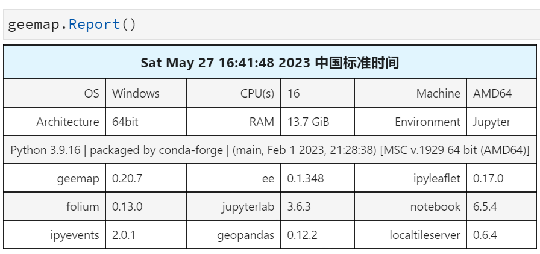

# Geemap 小技巧


### 1 可以通过 URL 加载自己发布的地图服务

根据不同的发布服务，使用不同的函数进行调用

geoserver发布的地图服务

```python
Map = geemap.Map()
Map.add_tile_layer(
    url="https://mt1.google.com/vt/lyrs=p&x={x}&y={y}&z={z}",
    name="Google Terrain",
    attribution="Google",
)
Map
```


### 2 python 加载本地文件时

`r"E:\MyDemo\test.html"` 等同于 `"E:\\MyDemo\\test.html"`


### 3 获取影像信息

```python
image.getInfo()
# 获取影像集合数量
collection.size().getInfo()
# 获取影像分辨率
image.projection().nominalScale().getInfo()
```


### 4 内置的调色板

内置了一百多个

```python
'palette': 'turbo'
```


### 5 克隆当前虚拟环境

```sh
conda env export > geemap01.yaml
```

基于当前文件克隆出虚拟环境

```sh
conda env create -f geemap01.yaml
```


### 6 Python 原始镜像源

使用原始镜像源更新

```sh
pip install -U geemap -i https://pypi.python.org/simple
```


### 7 查看当前环境

```
geemap.Report()
```




### 8 环境配置

考虑到各个包的复杂依赖环境，我们可以使用mamba库进行虚拟环境的配置。

首先，给基础虚拟环境安装 mamba 库

```sh
conda install -n base mamba -c conda-forge -y
```

然后，就可以使用 mamba 创建虚拟环境

```sh
mamba create -n geemap02  pygis rasterio leafmap geopandas localtileserver segment-geospatial geemap python=3.9 -c conda-forge
```

如果环境出现问题，可以使用移除命令移除。

```sh
conda remove -n geemap02 --all
```

