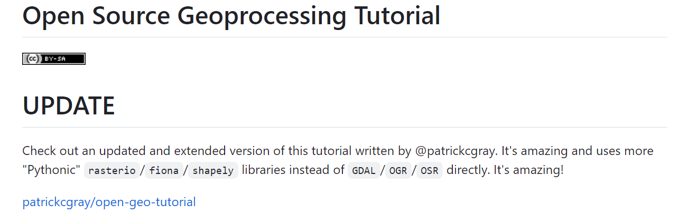

# GIS & RS 开发学习笔记

&emsp;&emsp;这是一个由亚瑟制作的展示 GIS&RS 开发学习记录的公开网站。

## 目录

### 1 GEE 系列教程

- [GEE 系列教程（已更新至第七节）](./gee/gee01.md)

- GEE小技巧：[gee-tips](./gee/gee_tips.md)

### 2 open-geo 教程

- [开源地理信息教程](./open-geo-zh/index.md)

## 参与贡献

1. 亚瑟 [gis-xh](https://github.com/gis-xh)
