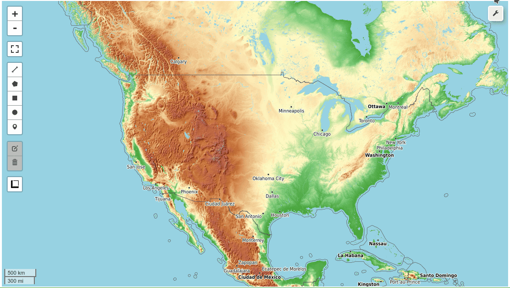
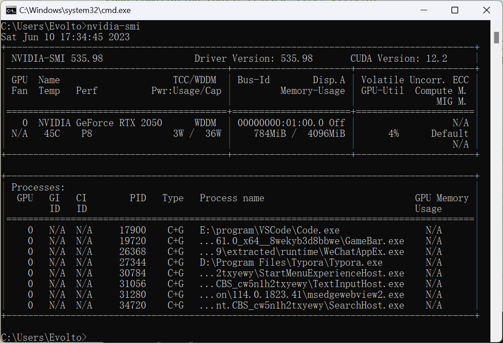
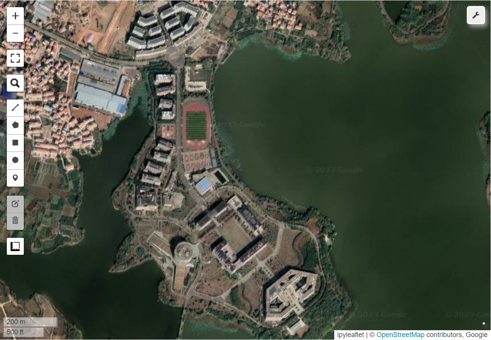
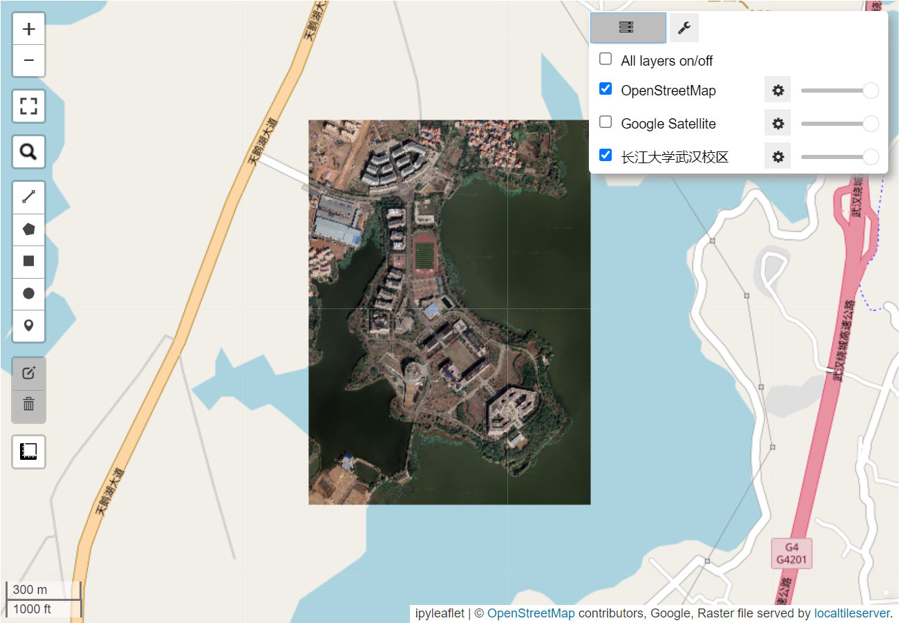
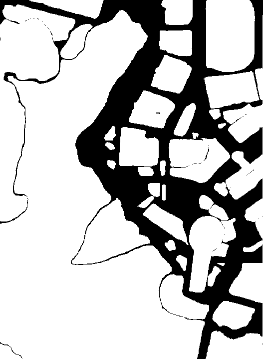
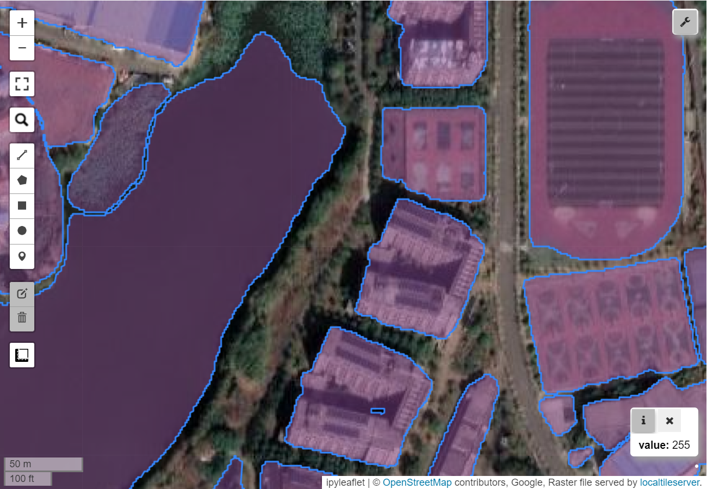
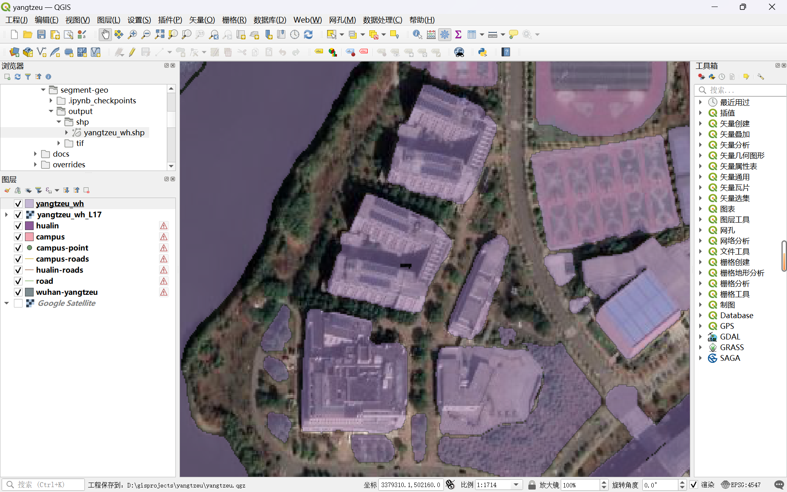

# 开源地理信息教程（一）分割一切！SAM与遥感影像的结合试验


## 前言

&emsp;&emsp;由于 GEE 平台的使用限制不断增多，尽管有 Geemap 这样优秀的第三方包，但还是存在诸多限制，于是笔者决定另辟蹊径，结合诸多开源的地理信息项目，制作一个开源地理信息教程系列。本系列将会分享 Github 开源的地理信息相关项目、开放地理数据下载、以及新兴技术在地理信息产业上运用。

&emsp;&emsp;本文作为新系列的第一篇教程，针对目前较为火热的 Segment Anything Model (SAM) 分割一切模型，介绍如何通过 Segment-geospatial 包的使用，实现对本地超高分辨率的栅格数据的快速分割提取，最终得到 shapefile 格式的矢量数据。

&emsp;&emsp;在本篇教程中，你将学习到以下内容：

| 内容                   | 方法                         |
| :--------------------- | :--------------------------- |
| GEE 平台的平替产品     | 使用 `leafmap` 包            |
| SAM 模型在地理上的运用 | 使用 `segment-geospatial` 包 |
| 下载底图的地图切片     | 使用 `tms_to_geotiff()` 函数 |
| 加载本地栅格数据       | 使用 `add_raster()` 函数     |


## 1 相关介绍

### 1.1 Segment Anything Model

&emsp;&emsp;[Segment Anything](https://github.com/facebookresearch/segment-anything) 是 Meta AI 研究的一个新项目，它提出了一种新的图像分割任务、模型和数据集。Segment Anything Model (SAM) 是一个可以根据输入提示（如点或框）产生高质量的对象掩码的模型，它还可以用于生成图像中所有对象的掩码。SAM 在一个包含 1100 万张图像和 10 亿多个掩码的大规模数据集上进行了训练，具有强大的零样本泛化能力，可以应对各种分割任务。SAM 的设计和训练还使得它可以被提示，即可以根据不同的输入提示转移到新的图像分布和任务上，而无需额外的训练。


<center>图 1-1 SAM 分割示例</center>

### 1.2 Segment-geospatial

&emsp;&emsp;[Segment-geospatial](https://samgeo.gishub.org/) 是 Geemap 包的作者吴秋生老师基于 SAM 分割一切模型开发的一个对地理空间数据进行快速分割的开源 Python 包，可以根据感兴趣区域高分辨率影像快速有效地提取矢量边界。


<center>图 1-2 samgeo 分割示例</center>

### 1.3 Leafmap

&emsp;&emsp;[Leafmap](https://leafmap.org/) 也是吴秋生老师开发的一个开源 Python 包，使用户能够在 Jupyter 环境（例如 Google Colab、Jupyter Notebook 和 JupyterLab）中以最少的编码分析和可视化地理空间数据，旨在为无法正常访问 GEE 的用户填补空白。



<center>图 1-3 Leafmap 官方操作演示</center>


## 2 环境配置

### 2.1 创建虚拟环境

&emsp;&emsp;在 [Geemap 教程（一）：Geemap 包的介绍与使用](../../gee/geemap01.md) 中，我们曾使用 mamba 库配置过 geemap 的虚拟环境。由于包的复杂依赖环境，如果我们是 Windows 的工作环境，需要使用 mamba 库创建虚拟环境。

> 给基础环境安装 mamba 库

```sh
conda install -n base mamba -c conda-forge -y
```

> mamba 库安装环境

```sh
mamba create -n samgeo segment-geospatial python=3.9 -c conda-forge
```

> 激活环境

```sh
conda activate samgeo
```

### 2.2 检查环境

&emsp;&emsp;由于 `segment-geospatial` 包是基于 `Pytorch` 的环境，为了更好地利用 GPU 的性能训练模型，我们需要安装与当前显卡设备的驱动版本匹配的 CUDA 工具。

> 检查显卡支持的最高 CUDA 版本

```sh
nvidia-smi
```

&emsp;&emsp;笔者当前电脑显卡驱动最高能支持 CUDA 12.2 版本，具体内容如下。



<center>图 2-1 当前显卡信息</center>

&emsp;&emsp;需要注意的是：pip、conda 以及 pytorch 官方都没有给出对 CUDA11.2 版本的支持。但是不用担心，pytorch 对于 CUDA 有很强的支持，我们直接安装其他版本即可。

### 2.3 安装 CUDA 支持

> 使用 conda 安装 cuda 支持

```sh
conda install cudatoolkit=11.3 -c pytorch -c conda-forge -y
```

> 使用 pip 重新安装 Pytorch

&emsp;&emsp;这里需要使用 pip 安装，使用 conda 安装会保持原状，不会重新安装 pytorch。命令参考自：[Previous PyTorch Versions | PyTorch](https://pytorch.org/get-started/previous-versions/)

```sh
pip install torch==1.12.1+cu113 torchvision==0.13.1+cu113 --extra-index-url https://download.pytorch.org/whl/cu113
```


<center>图 2-2 重新安装 Pytorch</center>


## 3 编程实现


### 3.1 基本配置

&emsp;&emsp;与往常一样，我们先导入 leafmap 以及刚刚安装的 Segment-geospatial 包。

```
import os
import leafmap
from samgeo import SamGeo, tms_to_geotiff
```

### 3.2 下载并显示地图瓦片

&emsp;&emsp;1、首先，加载谷歌卫星影像为底图，绘制矢量边界，下载矢量边界内的地图切片。

```python
point = [30.532181687, 114.024938132]
Map = leafmap.Map(center=point, zoom=16)
Map.add_basemap("SATELLITE")
Map
```



<center>图 3-1 加载谷歌影像底图</center>

&emsp;&emsp;2、绘制多边形边界，先检查是否已绘制边界，如果没有就按照指定左上右下角的坐标绘制。

```python
if Map.user_roi_bounds() is not None:
    bbox = Map.user_roi_bounds()
else:
    bbox = [114.018859863, 30.540618896, 114.030532837, 30.526885986]
```

&emsp;&emsp;3、指定输出路径，以绘制的多边形为边界，17 级的缩放级别下载地图，如果以存在同名文件则会将其覆盖。

```python
yangtzeu = "..\\data\\tif\\yangtzeu_wh_L17.tif"
tms_to_geotiff(
    output=yangtzeu,
    bbox=bbox,
    zoom=17,
    resolution=None,
    source="Satellite",
    overwrite=True,
)
```

&emsp;&emsp;4、在下载并拼接完影像后，使用 `add_raster()` 函数加载下载到地图中进行显示。

```python
Map.add_raster(yangtzeu, alpha=0.5, layer_name="长江大学武汉校区")
Map
```



<center>图 3-2 加载下载后的地图切片</center>

### 3.3 初始化 SAM 类

```python
sam = SamGeo(
    model_type="vit_h",
    checkpoint="sam_vit_h_4b8939.pth",
    device="cuda",
    sam_kwargs=None,
)
```

&emsp;&emsp;这里我们设置 `device="cuda"`，以此来调用设备的 GPU 进行运算，其他设置均为默认初始化设置。

### 3.4 分割影像

```python
sam.generate(
    source=yangtzeu,
    output=out_mask,
    foreground=True,
    batch=True,
    erosion_kernel=None,
    unique=True
)
```

&emsp;&emsp;`generate()` 函数作为 Samgeo 的核心函数，它将输入图像分割成 mask 掩膜，可以根据需要修改以下三个参数：

- `batch=True`: 批量分割图像，这对于无法放入内存的大图像很有用。

- `erosion_kernel=None`: 过滤对象掩码和提取边界的侵蚀核的参数设置。

- `unique=True`: 给每个对象分配唯一编码值

&emsp;&emsp;在分割过程中，由于笔记本显卡算力有限，即使图像很小，仍然训练了很长时间，同时机器的占用也很高，Samgeo 在分割影像时，需要较好的显卡设备。


<center>图 3-3 分割影像运行中</center>

&emsp;&emsp;然后，我们将分割好的 mask 掩膜显示出来，查看效果。

```python
sam.show_masks(cmap="binary_r")
```



<center>图 3-4 查看分割后的掩膜结果</center>

### 3.5 矢量化栅格数据

&emsp;&emsp;最后，以栅格转矢量的方式，将掩膜结果转化为矢量格式的文件，就可以得到本次对目标区域影像的分割矢量结果了。

```python
out_shp = os.path.join(shp_dir, "yangtzeu_wh.shp")
sam.tiff_to_vector(out_mask, out_shp, simplify_tolerance=None)
```

- `simplify_tolerance` 可以对输出矢量数据进行简化，值越大越简化。

## 4 分割结果

### 4.1 地图可视化

&emsp;&emsp;我们把分割的结果在地图上直接显示，可以看到分割的效果还是不错的。

```sh
style = {
    "color": "#3388ff",
    "weight": 2,
    "fillColor": "#7c4185",
    "fillOpacity": 0.5,
}
Map.add_vector(out_mask_shp, layer_name="Vector", style=style)
Map
```



<center>图 4-1 在地图上查看矢量数据</center>

### 4.2 在 QGIS 中查看数据

&emsp;&emsp;同样地，我们也可以将下载的谷歌影像数据以及分割后的结果在 QGIS 中加载显示。



<center>图 4-2 在 QGIS 中查看数据</center>


## 总结

&emsp;&emsp;本篇教程作为开源地理信息教程系列的第一篇教程，以长江大学武汉校区为研究区域，先是利用 Leafmap 包下载谷歌影像切片，再利用 Segment-geospatial 包对下载的影像进行分割，得到分割掩膜，最后以栅格转矢量的方式将结果转换成矢量数据，得到研究区域的矢量化结果。

&emsp;&emsp;尽管设备算力有限降低了分割的效果，但是可以看到分割结果还是较为不错的，这是 SAM 分割一切模型在遥感领域的一次尝试运用，其目的是希望能够给大家一个**快速、简便、高效**的遥感图像分割方案。本教程只是展示了 SAM 模型的基本功能和使用方法，更多的细节和技巧可以参考 [SAM 模型的官方网站](https://segment-anything.com/)和[论文](https://arxiv.org/abs/2304.02643)。我们相信 SAM 模型在未来会有更多的应用场景和创新可能，也欢迎大家在评论区分享自己的想法和经验。


## 参考文献

[1] Kirillov A, Mintun E, Ravi N, et al. Segment Anything[J]. arXiv:2304.02643, 2023.

[2] Qiusheng Wu, & Lucas Osco. (2023). samgeo: A Python package for segmenting geospatial data with the Segment Anything Model (SAM). Zenodo. https://doi.org/10.5281/zenodo.7966658

[3] Wu, Q. (2021). Leafmap: A Python package for interactive mapping and geospatial analysis with minimal coding in a Jupyter environment. *Journal of Open Source Software*, 6(63), 3414. https://doi.org/10.21105/joss.03414

[4] coder_yang56. 已有cuda11.2情况下Pytorch 环境配置 [EB/OL]. (2022-04-22)[2023-06-07]. https://blog.csdn.net/qq_41330902/article/details/124355474.