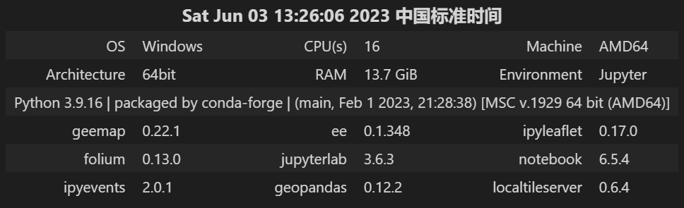

# Geemap 特别篇：分割一切！SamGeo 实现快速矢量化


## 前言

&emsp;&emsp;本文是 Geemap 教程的特别篇，针对目前较为火热的 Segment Anything Model (SAM) 分割一切模型，介绍如何通过 Geemap 与 Segment-geospatial 包的结合使用，实现对本地超高分辨率的栅格数据的快速分割提取，最终得到 shapefile 格式的矢量数据。

&emsp;&emsp;Segment-geospatial 是 Geemap 包的作者吴秋生老师基于 SAM 分割一切模型开发的一个对地理空间数据进行快速分割的 Python 包，可以根据感兴趣区域高分辨率影像快速有效地提取矢量边界。


## 1 相关介绍

### 1.1 Segment Anything

&emsp;&emsp;Segment Anything 是 Meta AI 研究的一个新项目，它提出了一种新的图像分割任务、模型和数据集。Segment Anything Model (SAM) 是一个可以根据输入提示（如点或框）产生高质量的对象掩码的模型，它还可以用于生成图像中所有对象的掩码。SAM 在一个包含 1100 万张图像和 10 亿多个掩码的大规模数据集上进行了训练，具有强大的零样本泛化能力，可以应对各种分割任务。SAM 的设计和训练还使得它可以被提示，即可以根据不同的输入提示转移到新的图像分布和任务上，而无需额外的训练。


### 1.2 Segment-geospatial

&emsp;&emsp;Segment-geospatial (samgeo) 是一个开源的 Python 包，旨在简化使用 Segment Anything 模型分割地理空间数据的过程。该包利用流行的 Python 库，如 `leafmap`、`ipywidgets`、`rasterio`、`geopandas` 和 `segment-anything-py`，为用户提供了一个简单的界面，以分割和遥感图像，并以各种格式导出结果，包括矢量和栅格数据。它还提供了在 Jupyter 环境中交互式下载遥感图像和可视化分割结果的功能。Segment-Geospatial 旨在通过提供一个用户友好、高效和灵活的地理空间分割工具来填补 Python 生态系统中的空白，而不需要训练深度学习模型。


## 2 环境配置

&emsp;&emsp;由于国内镜像源与官方镜像源对包的版本更新存在延迟，所以这里我们使用官方镜像源（https://pypi.python.org/simple） 进行安装和升级。

### 2.1 安装相关包

> 更新 Geemap 包

```sh
pip install -U geemap -i https://pypi.python.org/simple
```

> 安装 Segment-geospatial 包

```sh
pip install segment-geospatial -i https://pypi.python.org/simple
```

### 2.2 基本配置

&emsp;&emsp;除每次编译时在头部固定所需导入的包，这次我们还需要再导入刚刚安装的 Segment-geospatial 包。

```
import os
import ee
import geemap
ee.Initialize()
geemap.set_proxy(port="魔法工具的端口号")
from samgeo import SamGeo
```

&emsp;&emsp;输入以下命令可以查看当前环境的 geemap 工作环境。

```sh
geemap.Report()
```



<center>图 2-1 当前 Geemap 工作环境</center>


## 3 编程实现

### 3.1 加载本地栅格数据

&emsp;&emsp;首先，我们在以谷歌卫星影像为底图，使用 `add_raster()` 函数，读取本地已经下载好的超高分辨率影像数据，并显示在地图上。这是一种基于 `localtileserver` 包，以在本地发布栅格数据的形式，将影像显示在地图上，这里并没有与 GEE 平台进行交互，而且全程在本地上进行的。

Tips：请不要将魔法工具设为全局模式，否则栅格数据会由于无法发布在本地服务器导致不能正常加载。

```python
Map = geemap.Map(basemap="SATELLITE")
point = ee.Geometry.Point(114.024938132, 30.532181687)
yangtzeu = "../data/tif/yangtzeu_wh_L17.tif"
image = ee.Image(Map.add_raster(yangtzeu, alpha=0.5, layer_name="长江大学武汉校区"))
Map.centerObject(point, 16)
Map
```


### 3.2 提取分割腌膜

```sh
sam = SamGeo(
    model_type="vit_h",
    checkpoint="sam_vit_h_4b8939.pth",
    device=None,
    sam_kwargs=None,
)

out_mask = os.path.join(tif_dir, "yangtzeu_wh_masks.tif")

sam.generate(yangtzeu, out_mask, foreground=True, unique=True)

sam.show_masks(cmap="binary_r")

out_annotation = os.path.join(tif_dir, "yangtzeu_wh_annotations.tif")

sam.show_anns(axis="off", alpha=1, output=out_annotation)
```


### 3.3 开始训练模型

```python
sam.tiff_to_vector(out_mask, out_mask_shp)
```


### 3.4 地图可视化


```sh
style = {
    "color": "#3388ff",
    "weight": 2,
    "fillColor": "#7c4185",
    "fillOpacity": 0.5,
}
Map.add_vector(out_mask_shp, layer_name="Vector", style=style)
Map
```


### 3.5 在 QGIS 中查看数据


## 总结


## 参考文献

[1] Kirillov A, Mintun E, Ravi N, et al. Segment Anything[J]. arXiv:2304.02643, 2023.

[2] Wu, Q., (2020). geemap: A Python package for interactive mapping with Google Earth Engine. The Journal of Open Source Software, 5(51), 2305. https://doi.org/10.21105/joss.02305

[3] 135 segmentation - geemap [EB/OL]. https://geemap.org/notebooks/135_segmentation/. [2023-06-03].

[4] Qiusheng Wu, & Lucas Osco. (2023). samgeo: A Python package for segmenting geospatial data with the Segment Anything Model (SAM). Zenodo. https://doi.org/10.5281/zenodo.7966658